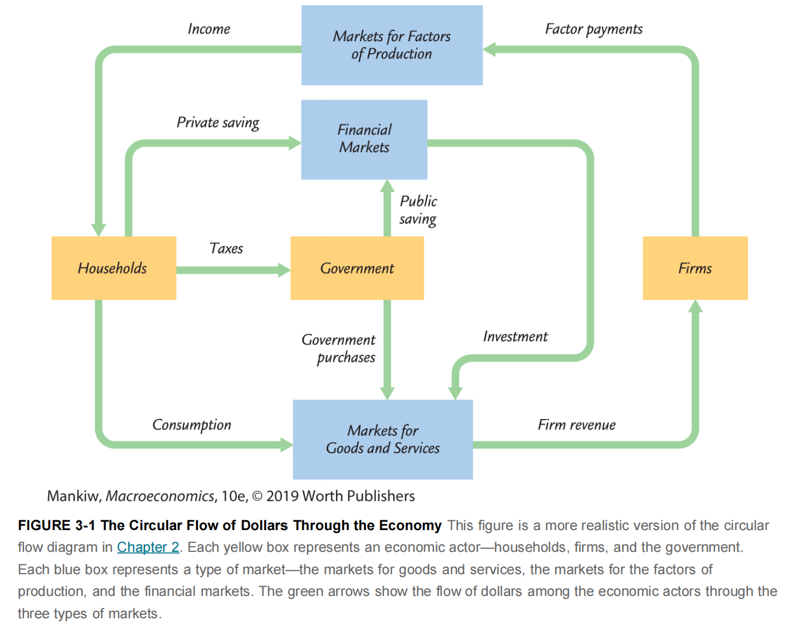
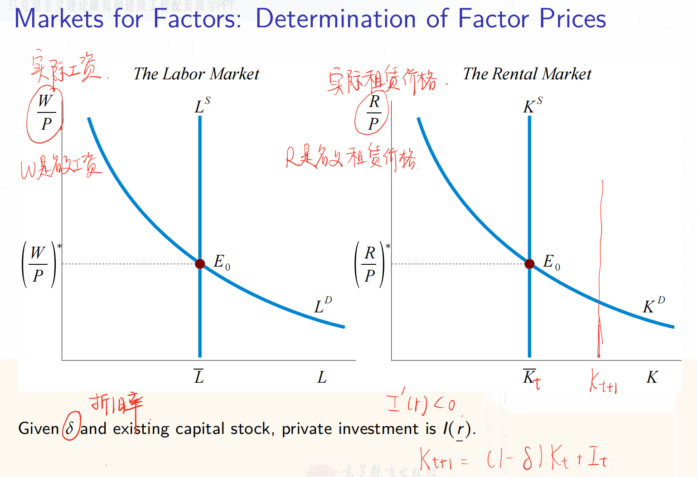
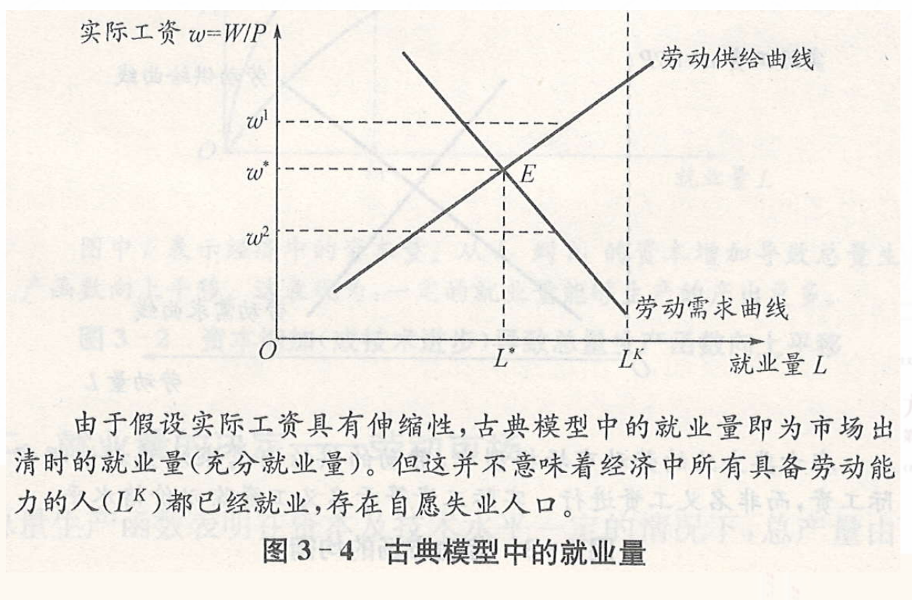
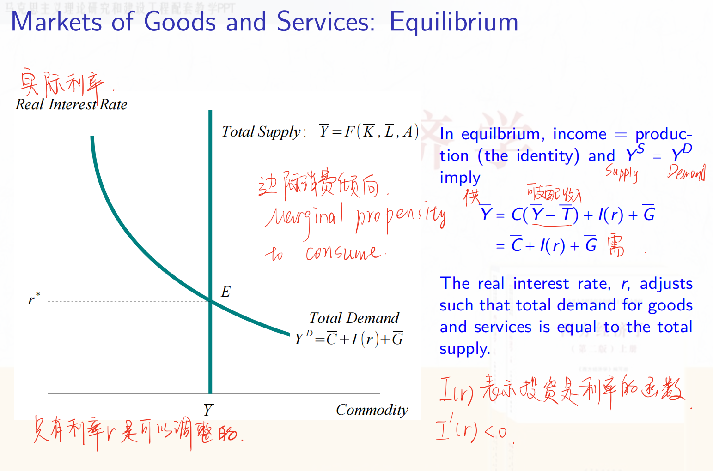
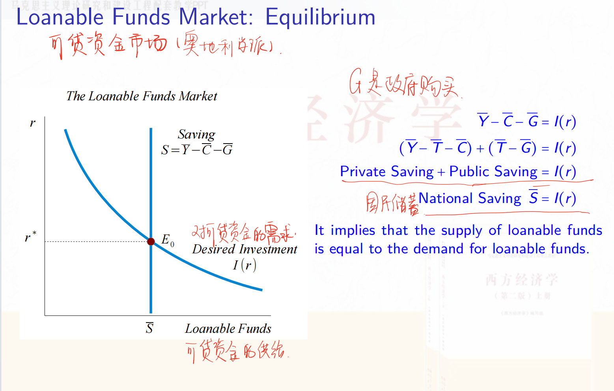
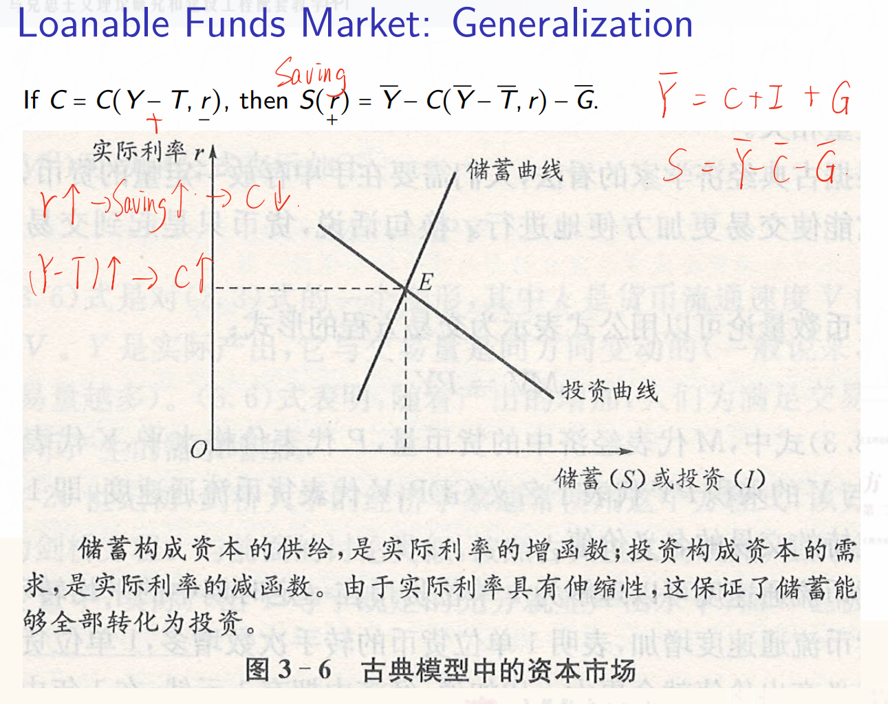
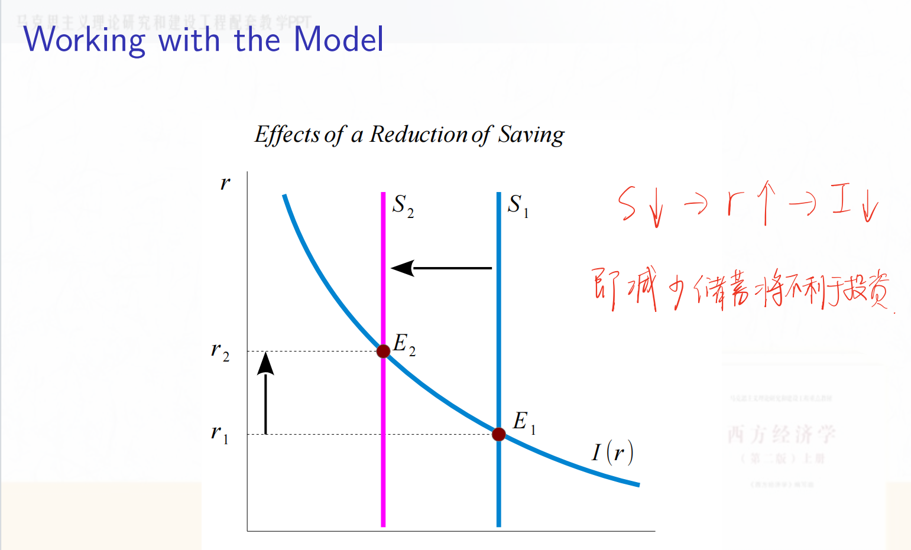

教材Ch3对应课件Lec2A

# Lec2A A Real Model of a Closed Economy

本章主要涉及三个市场间的联系：要素市场、商品市场、可贷资金市场（金融市场）

Assumption 1
For convenience, we assume $G^{\prime}=0, N F P=0, T R=0$, and $I N T^G=0$. It implies $G=G^C, \widetilde{I}=I, G D P=G N P=Y, C A=N X, Y^d=Y-T$.

## 2.1 生产函数

### 2.1.1 齐次性

==Definition 1==
A function $f: \mathbb{R}^n \rightarrow \mathbb{R}, y=f\left(x_1, x_2, \cdots, x_n\right)$, is said to be homogeneous of degree $k$ if
$$
f\left(t \cdot x_1, t \cdot x_2, \cdots, t \cdot x_n\right)=t^k \cdot f\left(x_1, x_2, \cdots, x_n\right) \qquad (1)
$$

Theorem 2
假设一个可微函数 $f: \mathbb{R}^n \rightarrow \mathbb{R}, y=f\left(x_1, x_2, \cdots, x_n\right)$, 是 k 次齐次的：

i. The partial derivatives of $f$ is homogeneous of degree $k-1$. That is, for every $j=1, \cdots, n$,

(1)式两边对 $x_j$ 求偏导： $f_j\left(t x_1, \cdots, t x_j, \cdots, t x_n\right)=t^{k-1} \cdot f_j\left(x_1, \cdots, x_j, \cdots, x_n\right)$;

ii. **Euler's theorem** holds:

对 t 求偏导： $k f\left(x_1, \cdots, x_n\right)=x_1 f_1\left(x_1, \cdots, x_n\right)+\cdots+x_n f_n\left(x_1, \cdots, x_n\right)$ ，

where $f_j$ denotes the partial derivative of $f$ with respect to the $j$ th argument.（偏导数即边际产出，而边际产出等于要素价格）

**欧拉定理**指出：如果产品市场和要素市场都是完全竞争的，而且厂商生产的规模报酬不变，那么在市场均衡的条件下，**所有生产要素实际所取得的报酬总量正好等于社会所生产的总产品**。该定理又叫做边际生产力分配理论，还被称为产品分配净尽定理。如上所述，要素的价格是由要素的市场供给和市场需求共同决定。在完全竞争的条件下，厂商和消费者都被动地接受市场形成的价格。现在的问题是：要素所有者按照市场形成的要素价格获得收入，全部要素收入是否等于社会总产品？

### 2.1.2 新古典性质

Let $Y(t)=F[K(t), L(t), A(t)]$ denote a production function where $Y$ is the flow of output produced at time $t, K$ is the durable physical input or physical capital input at time $t, L$ is the labor input at time $t$, and $A$ is the level of knowledge or technology at time $t$. $K$ and $L$ are two rival inputs while $A$ is a non-rival input.  K 和 L 是需要购买的，而 A 是免费使用的。

==Definition 3 (Neoclassical Properties，满足以下条件的生产函数称为新古典生产函数)==
A production function $F: \mathbb{R}_{+}^3 \rightarrow \mathbb{R}_{+}, Y=F(K, L, A)$, twice differentiable in $K$ and $L$, is neoclassical if it satisfies the following properties:

**i. 生产函数关于K和L是一次齐次的，即规模报酬不变：**
$$
F(\lambda K, \lambda L, A)=\lambda \cdot F(K, L, A), \quad \forall \lambda>0
$$
 $A$ 前面没有 $\lambda$ 是因为 A是免费使用的。

**ii. Positive and diminishing returns to private inputs.**
$$
\text{各要素的边际报酬为正：} F_K(K, L, A)>0, \quad F_L(K, L, A)>0, \\
\text{各要素的边际报酬递减：} F_{K K}(K, L, A)<0, \quad F_{L L}(K, L, A)<0
$$
**iii. Inada conditions.**
随着资本（或劳动）趋于零，资本（或劳动）的边际产出趋于无穷大；随着资本（或劳动）趋于无穷大，资本（或劳动）的边际产出趋于零，即生产函数满足Inada条件：
$$
\lim _{K \rightarrow 0} F_K=\lim _{L \rightarrow 0} F_L=+\infty, \lim _{K \rightarrow \infty} F_K=\lim _{L \rightarrow \infty} F_L=0
$$

## 2.2 要素市场

推导要素市场的需求曲线：

一家（完全竞争的）公司需要考虑使用多少劳动和多少资本，目的是为了实现公司利润的最大化：
$$
\max _{K, L} \quad P \times F(K, L, A)-W \times L-R \times K
$$

一阶条件为：

$$
F_L(K, L, A)=W / P, \quad F_K(K, L, A)=R / P
$$

这两个式子其实就是 $L$ 和 $K$ 的需求函数（在给定的要素价格下，雇佣多少要素可使利润最大化，即需求曲线上的每一点都是使公司利润最大化的点）。由于 $W / P = F_L(K, L, A) $，所以给定资本存量 $K$， $W/P$ 对 $L$ 求导就是 $F_{L L}(<0)$，因此 $W/P$ 关于 $L$ 递减。$K$ 的需求函数同理。

要素市场均衡：

假设资本和劳动的供给都是固定的（一条竖直的线）

$P$ 表示物价水平，资本的实际租赁价格（$\frac{R}{P}$）= 净收益率（$r$）+ 折旧率（$\delta$），在给定折旧率 $\delta$ 和资本存量 $\overline{K}$ 的情况下，私人投资 $I$ （即对资本的需求 $K^D$）是净收益率 $r$ 的递减函数。净收益率至少和把钱存银行的利率一样，否则持有资本的人不会愿意把资本出借给需要资本的人，而是会直接把钱存在银行。

工资是自由变动的，工资变动使得劳动需求变动，直到与固定的劳动供给相等（这里其实隐含了一个充分就业的假设，即要素市场是出清的，劳动需求等于劳动供给）。均衡后固定下来的这个工资和劳动数量就决定了国民产出中有多少是分配给劳动的。

## 2.3 充分就业

古典主义关于劳动市场的一个最核心的假设在于，实际工资具有伸缩性，它能够灵活地调节市场供求，从而使
劳动市场保持出清状态（图3-4 中的E点)，也即充分就业。

Defnition 4（充分就业：全是自然失业，没有非自愿的失业）
The ==*full-employment level*== of labor is an equilibrium level where the aggregate demand for labor is equal to the aggregate supply after the complete adjustment of nominal wage rate and the price of final goods. The output is called the *full-employment output*, *potential output* or *natural level of output* if labor is at full-employment level. The rate of unemployment corresponding to the full-employment level of labor is called the *natural rate of unemployment(自然失业率)*. 

The full employment of labor implies there is no *involuntary* unemployment. The defnition of full employment can be generalized to other factor-markets.

## 2.4 国民收入的分配

经济利润 $\pi=P Y-W L-R K=P Y- P \frac{W}{P} L- P \frac{R}{P} K$

由一阶条件可知，最大化的经济利润为：
$$
\text { Economic Profit }=P \times F(K, L, A)-P \times F_L \times L-P \times F_K \times K=0
$$

第二个等号是因为生产函数是一次齐次的，所以欧拉定理成立，所以经济利润为0。

$$
\begin{aligned}
& \text { Output } Y=\stackrel{F_L}{MPL} \times L \quad+\stackrel{F_K}{M P K} \times K  \\
& =\text { Labor Income + Capital Income + Depreciation of Capital } 
\end{aligned}
$$

此即国民收入的分配等式

>  注：Capital Income 和 Depreciation of Capital 都属于资本收入部分（MPK*K）。

## 2.5 商品市场

横轴是生产的商品数量，纵轴是实际利率。

我们之前已经假设K、L、A的供给是固定的，因此产出 Y （Income）是固定的（供给固定）。

C+I+G是需求 (expenditure)。由于居民消费是居民可支配收入 $Y-T$ 的函数，而居民可支配收入恒定，因此 $C$ 恒定。这里假设政府投资G也固定。只有实际利率 $r$ 是可以调整的，r的变化引起私人投资 $I$ 的变化，使得需求可以与供给相等。

## 2.6 萨伊定律

“值得注意的是，一种产品一旦被创造出来，从那一刻起，它就为其他产品提供了一个市场，这个市场的容量与该产品自身的价值完全相等（因为你拿卖出该产品的钱去市场上购买其他产品）。当生产者完成产品的制作后，他最急切的愿望就是立即出售它，以免其价值在自己手中减少。他同样急于处理掉他可能获得的钱，因为金钱的价值也是会消耗的。而处理掉金钱的唯一方式就是购买某种产品。因此，仅仅是创造一种产品的这一情况，就立即为其他产品打开了销路。”

==萨伊定律：供给创造它自己的需求==

## 2.7 可贷资金市场

由于假设是封闭经济，且没有政府投资，因此国民储蓄将全部用于国内私人投资。

这里假设储蓄与利率无关，是固定值。

利率会自行调整，直到企业想要投资的金额等于家庭想要储蓄的金额。如果利率过低，投资者想要获得的经济产出会超过家庭想要储蓄的部分。换句话说，可贷资金的需求量超过了供给量。当这种情况发生时，利率就会上升。相反，如果利率过高，家庭想要储蓄的金额会超过企业想要投资的金额；因为可贷资金的供给量大于需求量，利率就会下降。

还有一种情况是假设居民消费 $C$ 不仅是可支配收入的增函数，也是实际利率的减函数，因为当实际利率升高，人们就会更倾向于将钱存到银行，减少消费

储蓄下降将导致利率上升，投资借贷减少

## 疑难重点

(1) 掌握生产函数的 Homogeneity 以及欧拉定理。

见2.1

(2) 什么是新古典生产函数？

见2.1

(3) 掌握要素市场需求曲线的推导。

见2.2

(4) 什么是充分就业？什么是潜在产出？什么是自然失业率？什么是非自愿失业？

见2.3

(5) 能够证明国民收入分配的公式。

见2.4

(6) 商品市场上的总供给如何确定？总需求如何确定？

生产要素和生产函数决定了总供给（因为产出Y=F(K,L,A)），总需求=C+I+G，其中C和G固定，I由实际利率决定。

(7) 什么是萨伊定律？

供给会创造需求

(8) 如何从可贷资金市场理解商品市场的均衡？

利率自行调整决定私人投资（可贷资金市场），进而使商品市场的需求等于供给（商品市场均衡）。

## 背景资料 

古典经济学理论中的封闭经济实物模型主要关注经济体内部的生产、消费、储蓄和投资活动，而不考虑国际贸易和资本流动。以下是一些相关的背景知识：

1. **古典经济学学派**：
   - 古典经济学起源于18世纪末和19世纪初，代表人物包括亚当·斯密、大卫·李嘉图和约翰·斯图亚特·穆勒。
   - 该学派强调市场机制的自我调节能力，认为市场在没有政府干预的情况下能够达到资源的有效配置。

2. **封闭经济**：
   - 封闭经济是指一个不与外界进行商品、服务和资本流动的经济体。
   - 在这种模型中，所有的经济活动都发生在国内，经济分析集中于国内生产、消费、储蓄和投资。

3. **实物模型**：
   - 实物模型关注经济中的实际变量，如产出、就业和资本积累，而不是货币变量。
   - 这种模型通常假设价格和工资是灵活的，市场能够迅速调整以达到均衡。

4. **储蓄-投资恒等式**：
   - 在封闭经济中，储蓄等于投资（\(S = I\)），因为没有国际资本流动。
   - 这意味着国内储蓄完全用于国内投资，经济增长依赖于储蓄和投资的水平。

5. **生产函数**：
   - 经典模型通常使用生产函数来描述经济的产出水平，常见的形式是柯布-道格拉斯生产函数。
   - 生产函数展示了资本和劳动如何结合产生产出，并分析了资本积累对经济增长的影响。

6. **市场均衡**：
   - 经典理论认为市场通过价格机制达到均衡，供给和需求在市场上相互作用，决定了商品和服务的价格。

7. **政策含义**：
   - 古典经济学通常主张有限的政府干预，认为市场能够自我调节。
   - 政府的角色主要是提供法律框架和保护产权，以确保市场有效运作。

**1.古典二分法的含义**

古典二分法是指古典经济学把变量分为实际变量和名义变量来研究经济现象的方法。实际变量是用实物单位衡量的变量，例如数量和相对价格:名义变量是用货币表示的变量，例如价格水平和通货膨胀率，并且认为货币供给的变化不影响实际变量。在现实中，在长期，货币供给不会对实际变量产生影响；而在短期，货币供给量会对实际变量产生影响。

**2.货币中性**

货币中性是指货币供给变化不会影响就业、产出等实际变量，只会影响名义价格水平。实际上，在长期，货币中性是成立的；但在短期，货币非中性，即货币供给变化对实际经济变量会产生影响。不同学派对货币非中性的解释不同，凯恩斯认为是由于短期价格黏性导致货币非中性，而货币学派和理性预期学派则认为是由于人们预期的错误或政府的干预，使得短期货币非中性。
