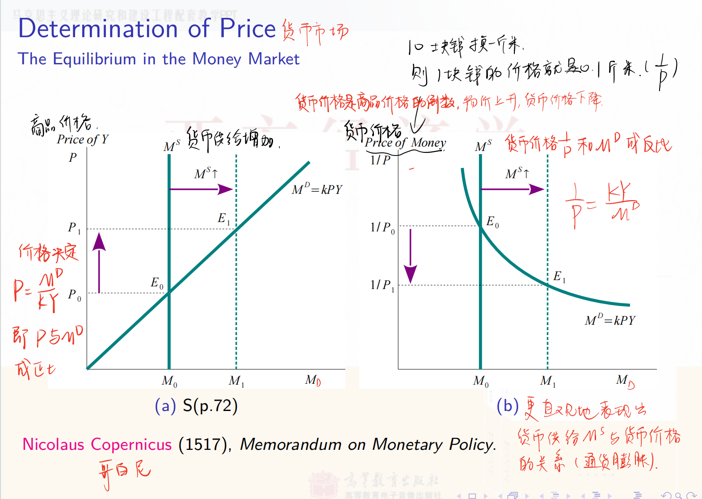
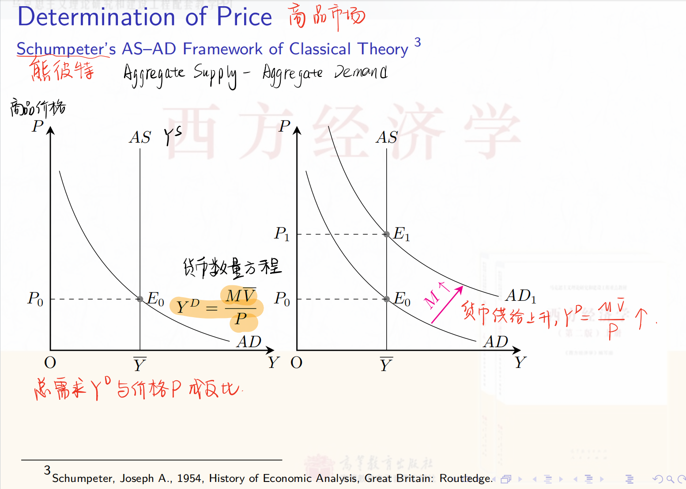

教材Ch4对应课件Lec2B内容

# Lec2B A Monetary Model of a Closed Economy

(1) 掌握古典经济学中的货币经济模型。

(2) 理解古典二分法。

## 2B.1 The Monetary System

### 2B.1.1 Creation of Money

Money is used for transactions and pays no interest. It includes two types of money: Currency (coins and bills) and checkable deposits (the bank deposits on which you can write checks). Bonds pay a positive interest but they cannot be used for transactions.

| Activities                                                   | Assets         |                    | Liabilities        |                    |
| ------------------------------------------------------------ | -------------- | ------------------ | ------------------ | ------------------ |
| Jack sells bonds to the central bank and deposits the money in private banks (工商银行) | Vault Cash (R) | +b                 | Checkable Deposits | +b                 |
| (工商银行) Loan to Tom                                       | Vault Cash (R) | $-b(1-\theta)$     |                    |                    |
|                                                              | Loan           | $b(1-\theta)$      |                    |                    |
| Tom's deposits（招商银行）                                   | Vault Cash (R) | $b(1-\theta)$      | Checkable Deposits | $b(1-\theta)$      |
| (招商银行）Loan to Jerry                                     | Vault Cash (R) | $-b(1-\theta)^2$   |                    |                    |
|                                                              | Loan           | $b(1-\theta)^2$    |                    |                    |
| Jerry's deposits (光大银行)                                  | Vault Cash (R) | $b(1-\theta)^2$    | Checkable Deposits | $b(1-\theta)^2$    |
| $\vdots$                                                     | $\vdots$       | $\vdots$           | $\vdots$           | $\vdots$           |
|                                                              | Total Assets   | $\frac{b}{\theta}$ | Total Liabilities  | $\frac{b}{\theta}$ |

注：课件中Assets列所有项目的符号应该是标反了

为了便于理解，我们假设这里的central bank是中国人民银行，其他的商业银行是工农中建交、招商银行、光大银行等，Jack向central bank出售国债，central bank相应地给Jack 100元人民币，Jack将这100元存入中国工商银行（b=100)，工商银行将这100元中的90元贷给Tom，自己留有10元（储备金），因此θ=10/100=0.1，Tom再将这90元存入招商银行，招商银行再将90（1-θ）=81元贷给Jerry，自己留有 $90 \theta=9$ 元，Jerry再将这81元存入光大银行，依次类推。central bank发行的100元最终变成了 $\frac{b}{\theta} = 1000$ 元的货币供给。

注意点：

- 这里的记账主体是商业银行

- 这里假设每个人身上都不留有现金，全部存到银行

- 工商银行将90元现金贷给Tom，相当于Tom给了银行一张债券，Tom是债务人，银行是债权人

术语表

| 缩写            | 释义                                                         | 中文                                                         |
| --------------- | ------------------------------------------------------------ | ------------------------------------------------------------ |
| $M$             | The money supply, the aggregate money, or the money stock    | 货币供给                                                     |
|                 | $M=D+C U$                                                    |                                                              |
| $B$             | The monetary base (中央银行发出来的货币，也称高能货币）      | 基础货币                                                     |
|                 | The monetary base  is defined as total liabilities of the central bank. $B= \text{Reserve deposits} + \text{Vault cash} + CU=R+CU$ |                                                              |
| $D$             | Checkable deposits                                           | 可以开支票的存款（这个其实是国外的概念，国外区分checking account和saving account，但是国内消费和储蓄是一体的，国内的活期存款类似于这个可支票存款） |
| $CU$            | Currency held by the nonbank public                          | 公众手中的通货                                               |
| $\theta=R / D$  | The banks' desired reserve-deposit ratio                     | 存款准备金率                                                 |
| $c_D=C U / D$   | The public's desired currency-deposit ratio                  | 通货存款比                                                   |
| $m=\frac{M}{B}$ | 货币乘数 $m=\frac{M}{B}=\frac{D+C U}{R+C U}=\frac{1+c_D}{\theta+c_D} \geq 1$. | 如果商业银行只存不贷，即吸收的存款全部作为准备金 $\Rightarrow \theta=1 \Rightarrow M=B$. |

注：

- （关于存款准备金率）A banking system with $\theta<1$ is called fractional reserve banking while the one with $\theta=1$ is called $100 \%$ reserve banking. 
  - 商业银行显然都倾向于将钱都贷出去以获得更多的收益, 但中央银行规定每贷出一笔帐款, 都必须按一定比率向中央银行存入一笔储备金( Reserve Deposits) 以应对挤兑的情况, 维持银行体系的稳定。
- （关于 $B$ 的名称）The monetary base is also called ==high-powered money, the central bank money, or outside money==. Outside money is the quantity of money coming from outside of the private sector. refer to The New Palgrave.
- （关于 $B$ 的定义）Reserve deposites or balances are balances held by depository institutions in master accounts and excess balance accounts at the central bank. Vault cash plus $C U$ is called currency in circulation, which is outside the Treasury and the central bank.

### 2B.1.2 Measuring Money

The monetary base, $B$, is also called $M_0$. There are two widely used definitions of the overall money $M^s$ (the aggregate money, the money supply, or the money stock):
(1) $M_1=\frac{1+c_D}{\theta+c_D} B$; 也即2.8.1中定义的 $M$，包括活期存款和公民持有的现金
(2) $M_2$ which composes $M_1$ and other assets that are somewhat less moneylike but almost checkable.
The US money stock measures can be found at Federal Reserve Statistical Release ( http://www.federalreserve.gov/releases/H6/).

注：

- China, $M_0$ is just measured as $C U$. 中国和美国对 $M_0$ 的定义不一样
- **M0被称为基础货币**，它指的是在银行体系外流通的现金，也就是大家没有存在银行而是拿在自己手上的钱，是货币构成中流动性最强的部分；在我国，**M1是在M0的基础上，加上企业活期存款**，代表了货币构成中流动性较强的那部分。**M2则是在M1的基础上，再加上企业定期存款、个人储蓄存款和其它存款**，因为它包括了M1里的所有货币，所以范围比M1、M0都要大，代表了货币构成中流动性较弱的部分。

## 2B.2

### 2B.2.1 The Transactions Form of the Quantity Equation

The relationship between transactions and money is called the **quantity** **equation** or the **equation of exchange**. The transactions form of the quantity equation is formulated by Simon Newcomb (1885) and popularized by Irving Fisher (1911).

**M**oney × **V**elocity = **P**rice × **T**ransactions

*M* × *V* = *P* × *T*

where *V* is the **transaction velocity of money** (the number of times money enters into transactions), *T* is the total number of transactions during some period of time, *P* is the price of a typical transaction. The quantity equation is an accounting identity

- M 代表货币供应量，即经济中流通的货币总量。
- V 代表货币的交易速度，指的是每单位货币在一定时间内用于交易的次数。换句话说，这是货币在经济中流通的频率。
- P 代表每笔交易的平均价格。
- T 代表在一定时间内的总交易数量。

这是一个恒等式，无法用于预测，我们需要将它变成一个理论，具体有两种做法：

第1种：假设 V 由金融交易制度决定, 短期内不变
The velocity of money is constant since it is determined by institutional factors and could be regarded as fixed for the short run. Under assumption 1, the quantity equation becomes the quantity theory of money（由恒等式变为数量理论）:
$$
M \times \bar{V}=P \times T
$$

where $M, T$, and $V$ are determined by other forces; $P$ is determined endogenously.

P是内生决定的内生变量，P必须要自由变化从而使等式两边相等（类比Lec2A中的利率 $r$）

Disadvantages: The number of transactions is difficult to measure. The volume of transactions includes final goods and services, intermediate goods, and existing assets.
The role of money: It serves as the medium of exchange. It is 'in motion.'（飞翔的货币）

### 2B.2.2 The Income Form of the Quantity Equation
Pigou (1927) replaced gross transactions with income transactions in the quantity equation. （解决交易次数无法衡量的问题）
$$
\begin{aligned}
\text { Money } \times \text { Velocity } & =\text { Price } \times \text { Output } \\
M \times V & =P \times Y
\end{aligned}
$$

where $V$ is the income velocity of money (the number of times money enters income), $Y$ is the output, and $P$ is the price of one unit of output.

- M：同transaction form
- V：此处是收入的货币流通速度，即每单位货币在测量期内转换为收入的次数。
- P：单位产出的价格水平。
- Y：产出，即经济总收入或实际生产的商品和服务总量。

(1) $V$ is constant under assumption $1 . V$ 不变, 外生
(2) $M$ is controlled by the central bank. 由中央银行控制, 外生
(3) $Y$ is determined by factor supply and the production function.
(4) $P$ is determined endogenously. 内生

The quantity theory of money implies that the quantity of money determines nominal GDP under assumption 1.
Due to $\dot{V}=0$, it also implies
$$
\frac{\dot{M}}{M}=\frac{\dot{P}}{P}+\frac{\dot{Y}}{Y}
$$
推导：
$$
\begin{aligned}
& M \bar{V}=P Y \quad M(t) \bar{V}=P(t) Y(t) . \\
& \ln M(t)+\ln \bar{V}=\ln P(t)+\ln Y(t)
\end{aligned}
$$

两边求导，得到 $\frac{M^{\prime}(t)}{M(t)}=\frac{P^{\prime}(t)}{P(t)}+\frac{Y^{\prime}(t)}{Y(t)}$

意义：货币增长率是指中央银行发行货币的速度，如果货币增长率等于经济增比率，则不会有通货膨胀。换言之，通货膨胀是一种货币现象，央行决定了通货膨胀。

### 2B.2.3 Cambridge Cash Balance Approach（剑桥现金余额方法）

第2种：剑桥方程式

Pigou (1917), Marshall (1923), and Keynes (1923) assumed that the demand for money would be a proportion of income. The demand for money, $M^D$, can be written as
$$
M^D=k P Y 
$$
where $P Y$ is the nominal income, $k$ is a constant which is the quantity of real money balances demanded for one unit of income. In equilibrium, the demand for money, $M^D$, is equal to the supply of money, $M$. The Cambridge approach to the quantity equation can be expressed to be
$$
M=k P Y
$$

(左边的 $M$ 是货币供给，右边的 $kPY$ 是货币需求，即 $M^D$)

which is equivalent to the income form of the quantity equation if $k=1 / V$. If people want to hold a lot of money (a high $k$ ), then money circulates slowly (a low V).

Advantages: It fits with the Marshallian demand-supply apparatus. 

The role of money: It is a temporary abode of purchasing power. It is 'at rest,' （栖息的货币）

理论意义：

- 剑桥方法中，货币需求主要取决于名义收入（P×Y）和人们的持币偏好（k）。持币偏好可能受到利率、经济不确定性和支付习惯等因素的影响。

- **与货币数量理论的区别**：
  - 传统的货币数量理论（如费雪方程）强调货币流通速度和交易量，而剑桥方法更关注个人和企业的持币动机。
  - 剑桥方法认为货币需求是由经济主体的行为和偏好决定的，而不是简单地由交易量决定。
- **政策含义**：
  - 剑桥方法为货币政策提供了一个框架，帮助理解为什么在某些情况下，增加货币供应可能不会立即导致价格水平的变化，因为货币需求的变化可能抵消货币供应的变化。
- **动态性**：
  - 剑桥方法允许货币需求随着经济条件的变化而变化，例如在经济不确定性增加时，人们可能会增加持币比例（k*k*），从而影响货币需求。

### 2B.2.4 Interest Rate and Inflation: the Fisher Effect

The Fisher equation is given by

$$
i_t=r_t+\pi_{t+1}
$$

where $\pi_{t+1}=P_{t+1} / P_t-1$ is the ex post inflation rate; $r_t$ is the ex post real interest rate. The ex ante version of the Fisher equation is

$$
i_t=r_t^A+\mathbb{E}_t \pi_{t+1}
$$

where $\mathbb{E}_t \pi_{t+1}$ is the expected inflation rate; $r_t^A$ is the ex ante real interest rate. In this case, $r_t^A$ is determined by the equilibrium in the loanable funds market. An increase in $\mathbb{E}_t \pi_{t+1}$ by one percentage point leads to an increase in the nominal interest rate by one percentage point. The one-to-one relation between $\mathbb{E}_t \pi_{t+1}$ and the nominal interest rate is called the Fisher effect.

费雪效应：预期通货膨胀率的上升会带来名义利率（一般由银行制定）的上升

名义利率i是银行给定的。提高利率可以吸引更多人存线，假设老百姓在期初预测期末的通货膨胀率为5个百分点，就会把这样的预期代入其期初的决策中，直接要求增加5个百分点的名义利率，则银行也会在名义利率上增加5个百分点（One to One）

### 2B.2.5 通胀的代价

### 2B.2.6 商品价格P的决定

从剑桥方程式的角度看（货币市场的角度）：

2. 黄金之理
   位一“金贱“即 货币价格下跌，对应商品价格上形

   侈 一金贵”即 货币价格上升，对应商品价格下降

3. 金错曷杯
位 之不买黄金制品一黄金进入流通领域→M个 一货币价格下降
了---…生活领域一黄金退出流通领域→货币价格上i侈 → 购买 ---.

从交易形式的数量方程的角度看（商品市场的角度）：

