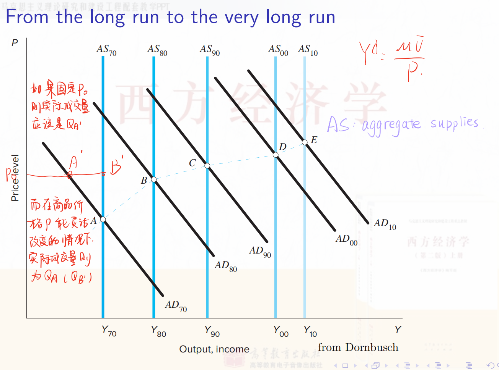

教材Ch4对应课件Lec2B内容

# Lec2B 封闭经济的货币模型

(1) 掌握古典经济学中的货币经济模型。

(2) 理解古典二分法。

## 2B.1 货币系统

### 2B.1.1 货币的创造

货币用于交易且不支付利息。它包括两种类型的货币：现金（硬币和纸币）和活期存款（可以开具支票的银行存款）。债券支付正利息，但不能用于交易。

| Activities                                                   | Assets         |                    | Liabilities        |                    |
| ------------------------------------------------------------ | -------------- | ------------------ | ------------------ | ------------------ |
| Jack sells bonds to the central bank and deposits the money in private banks (工商银行) | Vault Cash (R) | +b                 | Checkable Deposits | +b                 |
| (工商银行) Loan to Tom                                       | Vault Cash (R) | $-b(1-\theta)$     |                    |                    |
|                                                              | Loan           | $b(1-\theta)$      |                    |                    |
| Tom's deposits（招商银行）                                   | Vault Cash (R) | $b(1-\theta)$      | Checkable Deposits | $b(1-\theta)$      |
| (招商银行）Loan to Jerry                                     | Vault Cash (R) | $-b(1-\theta)^2$   |                    |                    |
|                                                              | Loan           | $b(1-\theta)^2$    |                    |                    |
| Jerry's deposits (光大银行)                                  | Vault Cash (R) | $b(1-\theta)^2$    | Checkable Deposits | $b(1-\theta)^2$    |
| $\vdots$                                                     | $\vdots$       | $\vdots$           | $\vdots$           | $\vdots$           |
|                                                              | Total Assets   | $\frac{b}{\theta}$ | Total Liabilities  | $\frac{b}{\theta}$ |

> 注：课件中Assets列所有项目的符号应该是标反了

为了便于理解，我们假设这里的central bank是中国人民银行，其他的商业银行是工农中建交、招商银行、光大银行等，Jack向central bank出售国债（现实中是由财政部发行国债，然后央行去买），central bank相应地给Jack 100元人民币，Jack将这100元存入中国工商银行（b=100)，工商银行将这100元中的90元贷给Tom，自己留有10元（储备金），因此θ=10/100=0.1，Tom再将这90元存入招商银行，招商银行再将90（1-θ）=81元贷给Jerry，自己留有 $90 \theta=9$ 元，Jerry再将这81元存入光大银行，依次类推。central bank发行的100元最终变成了 $\frac{b}{\theta} = 1000$ 元的货币供给。

注意点：

- 这里的记账主体是商业银行

- 这里假设每个人身上都不留有现金，全部存到银行

- 工商银行将90元现金贷给Tom，相当于Tom卖给银行一张债券，Tom是债务人，银行是债权人

术语表

| 缩写            | 释义                                                         | 中文                                                         |
| --------------- | ------------------------------------------------------------ | ------------------------------------------------------------ |
| $M$             | The money supply, the aggregate money, or the money stock.  $M=D+C U$ | 货币供给                                                     |
| $B$             | The monetary base, defined as total liabilities of the central bank.  $B= \text{Reserve deposits} + \text{Vault cash} + CU=R+CU$ | 基础货币 (中央银行发出来的货币，也称高能货币）               |
| $D$             | Checkable deposits                                           | 可以开支票的存款（这个其实是国外的概念，国外区分checkable account和saving account，只有checkable account可用于日常交易。而国内消费和储蓄是一体的，国内的活期存款类似于这个可支票存款） |
| $R$             | Total bank reserves = Vault Cash + Reserve deposits          | 准备金=银行自己地窖里的钱+银行在央行开的准备金活期账户里的钱 |
| $CU$            | Currency held by the nonbank public                          | 公众手中的通货                                               |
| $\theta=R / D$  | The banks' desired reserve-deposit ratio                     | 存款准备金率                                                 |
| $c_D=C U / D$   | The public's desired currency-deposit ratio                  | 通货存款比                                                   |
| $m=\frac{M}{B}$ | 货币乘数 $m=\frac{M}{B}=\frac{D+C U}{R+C U}=\frac{1+c_D}{\theta+c_D} \geq 1$. | 如果商业银行只存不贷，即吸收的存款全部作为准备金 $\Rightarrow \theta=1 \Rightarrow M=B$. |

注：

- （关于存款准备金率）A banking system with $\theta<1$ is called fractional reserve banking while the one with $\theta=1$ is called $100 \%$ reserve banking. 
  - 商业银行显然都倾向于将钱都贷出去以获得更多的收益, 但中央银行规定每贷出一笔帐款, 都必须按一定比率向中央银行存入一笔储备金( Reserve Deposits) 以应对挤兑的情况, 维持银行体系的稳定。
- （关于 $B$ 的名称）The monetary base is also called ==high-powered money, the central bank money, or outside money==. Outside money is the quantity of money coming from outside of the private sector. refer to The New Palgrave.
- （关于 $B$ 的定义）Reserve deposites or balances are balances held by depository institutions in master accounts and excess balance accounts at the central bank. Vault cash plus $C U$ is called currency in circulation, which is outside the Treasury and the central bank.

### 2B.1.2 衡量货币

The monetary base, $B$, is also called $M_0$. There are two widely used definitions of the overall money $M^s$ (the aggregate money, the money supply, or the money stock):

(1) $M_1=\frac{1+c_D}{\theta+c_D} B$; 也即2.8.1中定义的 $M$，包括活期存款和公民持有的现金

(2) $M_2$ which composes $M_1$ and other assets that are somewhat less moneylike but almost checkable.
The US money stock measures can be found at Federal Reserve Statistical Release ( http://www.federalreserve.gov/releases/H6/).

注：

- 中国和美国对 $M_0$ 的定义不一样，中国的 $M_0$ 不包括准备金，只包括公众手里的通货 $CU$
- **M0被称为基础货币**，它指的是在银行体系外流通的现金，也就是大家没有存在银行而是拿在自己手上的钱，是货币构成中流动性最强的部分；在我国，**M1是在M0的基础上，加上企业活期存款**，代表了货币构成中流动性较强的那部分。**M2则是在M1的基础上，再加上企业定期存款、个人储蓄存款和其它存款**，因为它包括了M1里的所有货币，所以范围比M1、M0都要大，代表了货币构成中流动性较弱的部分。

## 2B.2 古典货币理论

### 2B.2.1 数量方程式的交易形式

交易与货币之间的关系被称为数量方程式或交换方程式。数量方程式的交易形式是由西蒙·纽康（Simon Newcomb）在1885年提出，并由欧文·费雪（Irving Fisher）在1911年普及的。

**M**oney × **V**elocity = **P**rice × **T**ransactions（*M* × *V* = *P* × *T* ）

- M 代表货币供应量，即经济中流通的货币总量。
- V 代表货币的交易速度，指的是每单位货币在一定时间内用于交易的次数。换句话说，这是货币在经济中流通的频率。
- P 代表交易的平均价格，或者一笔典型交易的价格。
- T 代表在一定时间内的总交易数量。

这是一个恒等式，无法用于预测，我们需要将它变成一个理论，具体有两种做法：

假设1：假设 V 由金融交易制度决定, 短期内不变
货币流通速度是恒定的，因为它由制度因素决定，在短期内可以被视为固定的。在假设1下，数量方程式转变为货币数量理论（由恒等式变为数量理论）:
$$
M \times \bar{V}=P \times T
$$

M, T, V是外生的，P是内生决定的内生变量，P必须要自由变化从而使等式两边相等（类比Lec2A中的利率 $r$）

缺点：交易数量 $T$ 难以测量，它包括最终商品和服务、中间商品以及现有资产的交易。

货币的作用：它作为交换媒介。它是"运动中的"（飞翔的货币）。

### 2B.2.2 数量方程式的收入形式
庇古（Pigou）在1927年在数量方程式中用收入交易代替了总交易（解决交易次数无法衡量的问题）。
$$
\begin{aligned}
\text { Money } \times \text { Velocity } & =\text { Price } \times \text { Output } \\
M \times V & =P \times Y
\end{aligned}
$$

where $V$ is the income velocity of money (the number of times money enters income), $Y$ is the output, and $P$ is the price of one unit of output.

- M：同transaction form。由中央银行控制, 外生
- V：此处是收入的货币流通速度，即每单位货币在测量期内转换为收入的次数。在假设1下是个常数，外生
- P：单位产出的价格水平。内生
- Y：产出，即经济总收入或实际生产的商品和服务总量。由要素供给和生产函数形式决定，外生

> 例：假设一个简化的经济体系：
>
> 1. 总货币量(M)为1000元
> 2. 一年内该经济体的名义GDP(P×Y)为5000元
>
> 根据数量方程式 M×V = P×Y，我们可以计算出V = 5000÷1000 = 5
>
> 这意味着平均每一元钱在一年内被用于购买最终商品和服务的次数是5次。换句话说，货币流通速度为5。
>
> 具体例子：
>
> - 假设张先生收到1000元工资
> - 他用这1000元在超市购买食品
> - 超市用这1000元支付给供应商
> - 供应商用这1000元支付员工工资
> - 员工用这1000元购买电子产品
> - 电子产品销售商用这1000元支付店铺租金
>
> 在这个例子中，同样的1000元在一年内参与了5次收入交易，创造了5000元的经济活动。因此，收入货币流通速度(V)为5。

货币数量理论意味着在假设1下（V不变），货币数量（M）决定名义GDP（P*Y）。

此外，由于 $\dot{V}=0$, 我们还可以得到：
$$
\frac{\dot{M}}{M}=\frac{\dot{P}}{P}+\frac{\dot{Y}}{Y}
$$
推导：
$$
\begin{aligned}
& M \bar{V}=P Y \quad M(t) \bar{V}=P(t) Y(t) . \\
& \ln M(t)+\ln \bar{V}=\ln P(t)+\ln Y(t)
\end{aligned}
$$

两边求导，得到 $\frac{M^{\prime}(t)}{M(t)}=\frac{P^{\prime}(t)}{P(t)}+\frac{Y^{\prime}(t)}{Y(t)}$

意义：货币增长率是指中央银行发行货币的速度，如果货币增长率等于经济增长率，则不会有通货膨胀。换言之，通货膨胀是一种货币现象，央行决定了通货膨胀。

### 2B.2.3 剑桥现金余额方法（Cambridge Cash Balance Approach）

第2种：剑桥方程式

庇古（1917年）、马歇尔（1923年）和凯恩斯（1923年）假设对货币的需求将是收入的一个比例。对货币的需求，$M^D$, 可以写为
$$
M^D=k P Y 
$$
其中 $P Y$ 是名义收入， $k$ 是一个常数，表示每单位收入所需的实际货币余额数量。在均衡状态下，货币需求 $M^D$ 等于货币供给 $M$（供给由中央银行控制，是固定的）。 剑桥学派对数量方程的表达可以写为（左边的 $M$ 是货币供给，右边的 $kPY$ 是货币需求，即 $M^D$）
$$
M=k P Y
$$

如果 $k=1 / V$，这等同于数量方程的收入形式。如果人们想持有大量货币（较高的 $k$），那么货币流通缓慢（较低的 $V$）。

优点：它符合马歇尔的供需分析框架。

货币的角色：它是购买力的临时居所。它是"静态的"（栖息的货币）

### 2B.2.4 利率与通货膨胀：费雪效应

费雪方程由下式给出：

$$
i_t=r_t+\pi_{t+1}
$$

其中， $\pi_{t+1}=P_{t+1} / P_t-1$ 是事后通货膨胀率， $r_t$ 是事后实际利率。费雪方程式的事前版本是

$$
i_t=r_t^A+\mathbb{E}_t \pi_{t+1}
$$

其中，$\mathbb{E}_t \pi_{t+1}$ 是预期通货膨胀率; $r_t^A$ 是事前实际利率。在这种情况下， $r_t^A$ 由可贷资金市场的均衡决定。$\mathbb{E}_t \pi_{t+1}$ 增加一个百分点导致名义利率增加一个百分点。$\mathbb{E}_t \pi_{t+1}$​ 与名义利率之间的一对一关系被称为费雪效应。

==费雪效应：预期通货膨胀率的上升会带来名义利率（一般由银行制定）的上升==

名义利率i是银行给定的。提高利率可以吸引更多人存线，假设老百姓在期初预测期末的通货膨胀率为5个百分点，就会把这样的预期代入其期初的决策中，直接要求增加5个百分点的名义利率，则银行也会在名义利率上增加5个百分点（One to One）

### 2B.2.5 通胀的代价

预期通货膨胀的成本（S，P.170）：

1. 通货膨胀的"皮鞋成本"。费雪效应意味着通货膨胀提高了名义利率，这降低了对实际货币余额的需求。因此，人们不得不比以前更频繁地去银行。（由于通货膨胀腐蚀了现金的价值，人们将减少现金持有，更多地把钱存进银行）
2. 菜单成本。生产者必须比以前更频繁地更改其公布的价格。
3. 当生产者无法灵活地更改价格时，由相对价格变动导致的微观经济效率低下。
4. 改变税收负担，通常是以立法者未预期的方式。
5. 生活在一个标准不断变化的世界中的不便。货币是我们衡量经济交易的标准。

非预期通货膨胀的成本（S，P.171）：

1. 个人之间财富的重新分配。
2. 它伤害了靠固定收入生活的个人。
3. 信息不完善的个人常常有价格误判，这扭曲了他们的决策。

通货膨胀的一个好处：在零通货膨胀世界中的2%工资削减，在实际意义上，与5%通货膨胀下的3%加薪相同。

### 2B.2.6 商品价格P的决定

（1）从剑桥方程式的角度看（货币市场的角度）：

2. 黄金之理
   位一“金贱“即 货币价格下跌，对应商品价格上形

   侈 一金贵”即 货币价格上升，对应商品价格下降

3. 金错曷杯
位 之不买黄金制品一黄金进入流通领域→M个 一货币价格下降
了---…生活领域一黄金退出流通领域→货币价格上i侈 → 购买 ---.

（2）从交易形式的数量方程的角度看（商品市场的角度）：

### 2B.2.7 古典二分法（The Classical Dichotomy）

经济的实际方面：
$$
\left.\begin{array}{l}\text { Firm: } \max \text { Profit } \Longrightarrow K^D, L^D \\ \text { Household: } K^S=\bar{K}, L^S=\bar{L}\end{array}\right\} \Longrightarrow\left\{\begin{array}{l}w / P, R / P, r . \\ \text { Output } \bar{Y}=F(\bar{K}, \bar{L}, A) .\end{array}\right.
$$
经济的名义方面：
$$
\begin{aligned}
\left.\begin{array}{l}
\text { Cambridge Equation: } M^D=k P Y \\
\text { Central Bank: } M^S=\bar{M}
\end{array}\right\} & \Longrightarrow P=\bar{M} /(k \bar{Y}) \\
& \Longrightarrow \text { Inflation Rate } \pi \\
& \Longrightarrow \text { Nominal Interest Rate } i
\end{aligned}
$$
在古典宏观经济理论中，经济的实际方面和名义方面可以被分开分析，这被称为古典二分法。也就是说，实际变量如Y、R/P和w/P可以完全不考虑货币供给、价格和名义利率而被确定。因此，作为面纱的货币是中性的。

在费雪方程 $r=i-\pi$中，r 完全是由实体经济决定的，$\pi$ 是由货币供给决定的，因此是 r 和 $\pi$ 决定了名义利率 $i$，而不是 $i$ 和 $\pi$ 决定了实际利率r。这就符合古典二分法中名义经济不会影响实体经济的假设。

货币面纱论早期是柏拉图和亚里士多德，后来是让·巴蒂斯特·萨伊(Say Jean Baptiste)、约翰·穆勒(uohn stuart mi)、古斯塔夫·卡塞尔(Gustav cassel)、斯密、李嘉图、魁奈等人倡导。
货币面纱论的基本观点、主张：
认为“商品一货币一商品"的实质是商品交换，货而本身没有价值，只是一种便利交换的媒介，因此他们把货币的职能归结为流通手段，认为货币经济只不过是覆盖在实物经济上的一层薄薄的“面纱”，对实物经济不发生实质性影响。
当人们看不透这层面纱，认为货币本身也有价值时，就会产生货币幻觉。货币只是随着实物经济的变化而变化，本身不是经济变化的动力，考察经济力量的活动必须揭掉遮盖在实物经济上的面纱-一货币。
古典经济学家和新古典经济学家都认为货币对经济无实质作用，即认为货币对实际产出水平不产生影响。"货币面纱论”认为，货币对于实际经济过程来说，就像罩在人脸上的面纱，它的变动除了对价格产生影响外，并不会引起诸如储蓄、投资、经济增长等实际经济部门的变动。如果说，在一定条件下，货币供给在短期内还具有增加实际产出的效应，从长时期考察，也只能增加名义产出量，而不能提高实际产出水平。

## 2B.3 宏观经济学的时间框架

图中画的是长期的情况（因为均衡本身就是一个长期的概念，短期通常处于非均衡状态，由AS和AD曲线相交得到的均衡自然是在长期中才会实现）

要素市场

(1) 短期内，生产要素的总供给是固定的（$\bar{K}$，$\bar{L}$），而工资和价格是粘性的。可能发生要素的非自愿失业（L < L̄，K < K̄）。

(2) 长期内，生产要素的总供给是固定的（$\bar{K}$，$\bar{L}$），但是工资和价格是灵活的。不存在要素的非自愿失业（L = L̄，K = K̄）。

(3) 超长期内，生产要素的总供给会发生变化；工资和价格是灵活的。

凯恩斯宏观经济学对应于短期分析；古典宏观经济学集中于长期分析；而经济增长理论则对应于超长期分析。

## 疑难重点

(1) 掌握 the quantity theory of money, Cambridge cash balance approach, the Fisher effect.

数量理论分见2B.2.1和2B.2.2，剑桥方程式见2B.2.3，费雪效应见2B.2.4

(2) 预期到的和非预期到的通胀，会产生什么成本？

见2B.2.5

(3) 古典经济学中，价格是如何决定的？什么是古典二分法？

价格的决定见2B.2.6，古典二分法见2B.2.7