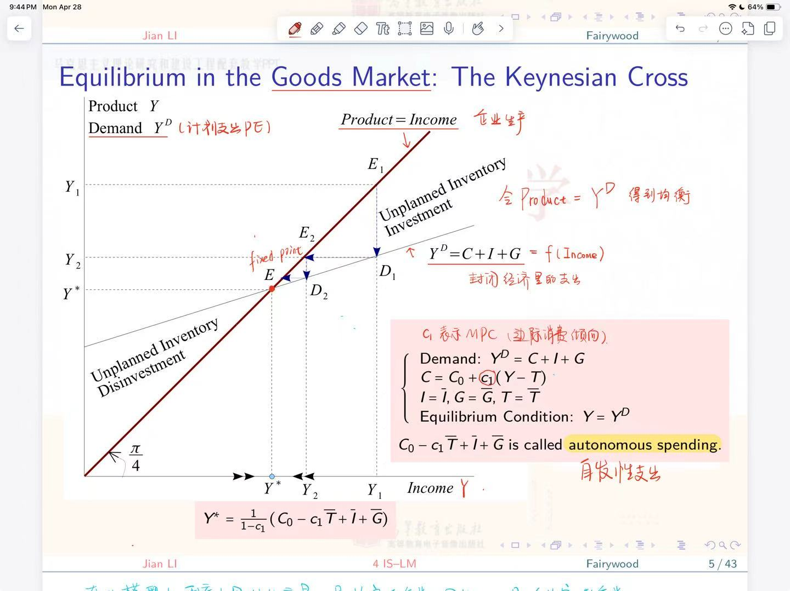
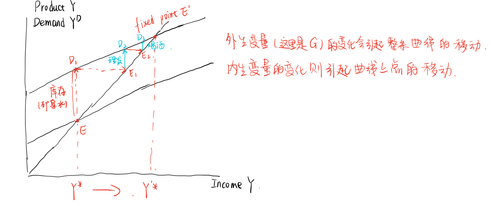
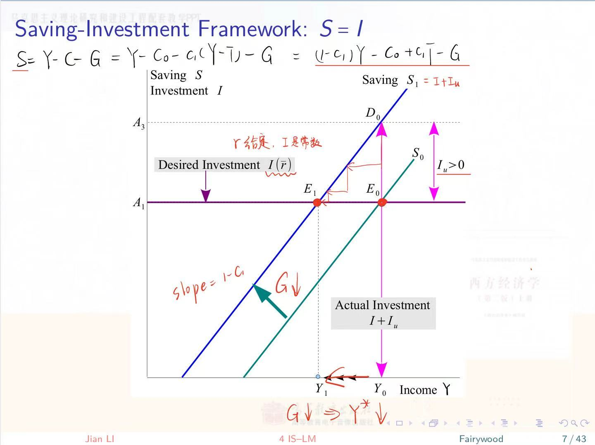
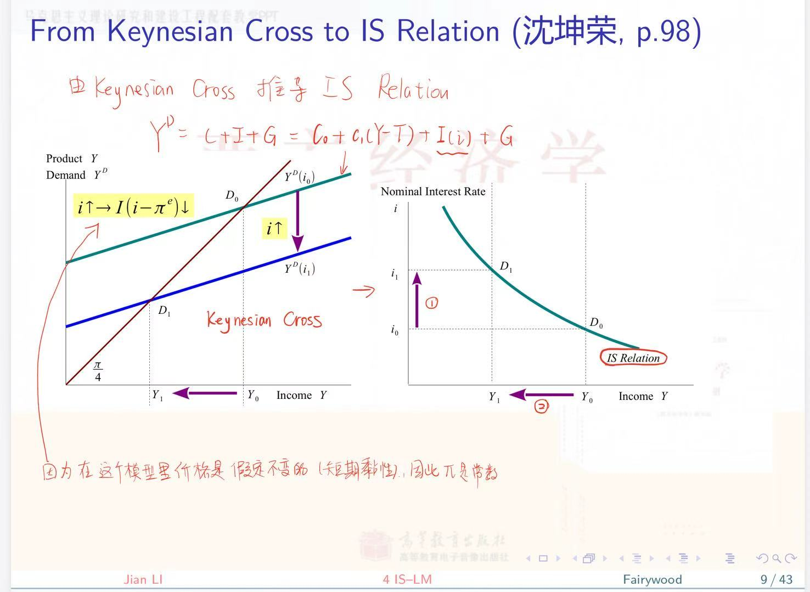
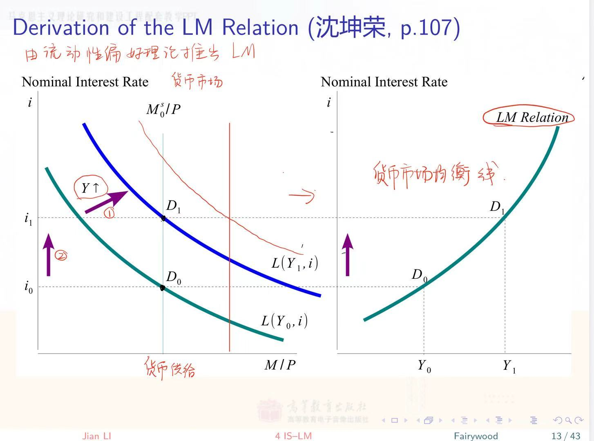

# Lec4A 商业周期理论：IS-LM模型

## 4A.1 商品市场的均衡

### 凯恩斯交叉

两条线，生产和支出都是收入的函数，生产就是等于收入，而支出=。当这两条线交叉，即产出=需求时，达到均衡

在此模型中，利率 r 是外生变量，是给定的参数，因此投资 I 也是一个给定的参数。同样 G ，T等也是参数
1．均衡：$Y=Y^D$ ，即产出等于计划支出。
当 $Y>Y^*$ 时，例如当产出为 $Y_1$ 时，计划支出为 $Y_2\left(\right.$ 点 $D_1$ ），企业在下一期便根据 $Y_2$ 来进行生产。从而横轴对应的收入也变为 $Y_2$ ，而 $Y_2$ 所对应的计划支出（点 $D_2$ ）也会相应下降，因此下一期的产出依然大于计划支出。以此类推，直到 $Y=Y^*$ 。这一过程与索洛模型相似。但不同之处在于凯恩斯交叉是离散的，而索洛模型是连续的。
$$
Y=\frac{C+I+G}{Y^D}=C_0+\underset{M P C}{c_1}(Y-T)+I+G \Rightarrow Y^*=\frac{C_0-c_1 T+I+G}{1-c_1}
$$

2，政府购买的乘数效应。
$\frac{\partial Y^*}{\partial G}=\frac{1}{1-c_1}$ 。—般 $c_1 \in(0,1)$ ，表示一般收入的一部分用于消费，一部分会存起来。假设 $c_1=\frac{1}{2}$ ，若 $\Delta G=2$ ，则当下 $\Delta Y=2$ （即支出曲线上移2），但最终 $\Delta Y=\Delta G \cdot \frac{1}{1-c_1}=4$ ．

现在假设政府购买增加，如多购买一瓶矿泉水($E \rightarrow D_1$)，则 $Y^D$ 会向上平移。这瓶矿泉水来自于上一期的库存，因此不计入当期的GDP。对于生产者而言，由于$Y^D$ 上升，,他们会据此增加自己的生产。而根据 Product=Income，居民的收入水平会随之提高，因此消费水平也会提高。比如由于收入增加，你决定去理个发。这样理发店老板的收入也会提高；他决定去喝酒，这样酒馆老板的收入也提高了,他的消费需求也要增加，以此类推。由此可见，政府购买会引发一连串的反应。

### 储蓄-投资框架：储蓄=投资

The saving is defined as $S \triangleq Y-C-G$ ．In a closed economy，

$$
\begin{aligned}
& \text { 实际: } Y=Y^D+I_u \\
& \text { 计划: } Y^D=C+I+G   \\
& Y = C+(I+I_u)+G \\
& S = I+I_u
\end{aligned}
$$

where $I$ is the desired investment while $I+I_U$ is the ex post investment．It implies the saving is always equal to the ex post investment（by means of adjustments of inventory investment）．In equilibrium，$I_u=0$ and $S=I$ ，that is，the saving is equal to the desired investment．
与古典理论中商品市场的S＝I一致，但二者属于不同框架。

初始均衡点为 $E_0$，此时假设政府购买G下降，则储蓄曲线从 $S_0$ 上移到 $S_1$，此时储蓄 $D_0$ 会高于所需的投资 $I(\bar{r})$（是个常数），也即$I_u>0$，因此会逐渐回到 $E_1$

### 商品市场的均衡条件

当商品市场处于均衡时，以下三个条件等价：

- $Y=Y^D$
- $I_u=0$
- $S=I$

### 从凯恩斯交叉到IS曲线

IS曲线代表"投资-储蓄"(Investment-Saving)曲线。

在凯恩斯交叉中，假设短期价格黏性（即预期通胀 $\pi^e$ 是常数），名义利率i上升会导致投资需求下降，从而总需求 $Y^D$ 下降，均衡点从 $D_0$ 下移到 $D_1$，产出下降。由此可以得到 IS 曲线：名义利率下降，产出上升。

IS曲线描述了商品市场均衡状态，显示利率和产出(GDP)之间的关系，表示投资和储蓄在不同利率水平下的均衡点

- 利率下降 → 投资增加 → 总需求增加 → 产出(GDP)增加
- 利率上升 → 投资减少 → 总需求减少 → 产出(GDP)下降

横轴：实际GDP/总产出，纵轴：利率，曲线呈负斜率，代表利率与产出的反向关系

## 4A.2 金融市场的均衡

既然持有货币就会失去利息收人,那么人们为什么还要把不能生息的货币保留在手中呢？凯恩斯认为,人们持有货币或者说需要货币,是出于

以下三类不同的动机。

(一)交易动机的货市需求（与利率负相关,与收入正相关）

交易动机,指个人和企业需要货币是为了进行正常的交易活动。由于人们取得收人和消费支出在时间上不是同步的,因此个人和企业必须要有

足够的货币资金来支付日常开支。

(二)预防动机的货币需求（与收入正相关）

预防动机(谨慎动机),指人们需要货币是为了预防经济生活中预料之外的支出,如个人和企业为应付事故、失业、疾病等意外事件而需要事

先持有一定数量的货币。

(三)投机动机的货市需求（与利率负相关 ）

投机动机,指人们持有货币是为了在金融市场上抓住购买有价证券的有利机会。

流动性偏好理论：实际货币需求与收入正相关，与理论负相关。用公式写成：
$$
\frac{M^D}{P} = L(\underset{+}{Y},\underset{-}{i})
$$
假设（1）价格P给定；（2）货币供给 $M^S$ 由中央银行控制

LM曲线表示 liquidity-money 曲线

收入上升引起货币需求增加，导致利率上升。因此LM曲线就是：收入上升，利率上升

