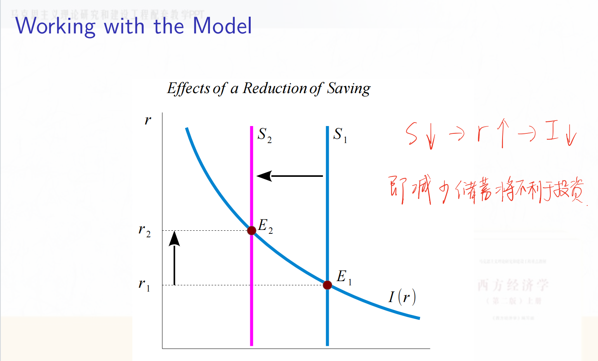

# Lec1A 测算GDP 

(1) 掌握 GDP 的核算方法，了解 GDP 指标的缺陷。

(2) 熟悉国民收入账户中的常见指标。

(3) 会查阅中国和美国的 GDP 数据。

(4) 掌握两个恒等式。

## 1.1 测算GDP

### 1.1.1 什么是GDP?

Definition 1

Gross domestic product (GDP) in National Income and Product Accounts (NIPA) is the market value of all final goods and services produced in an economy during a specified period, such as a year.

key points:

(1) In a market;

(2) It is a value such that different things can be added. Thus it can be

affected by price changes;

(3) Statistical scope: all, goods and services;

(4) Final goods, rather than intermediate goods. Services are

automatically final;

(5) Produce. Transfer of used goods is not considered;

(6) Regional scope: in an economy;

(7) A flow variable: during a specified period.

### 1.1.2 GDP的核算方法

核算GDP有3种方法，生产法、支出法和收入法

#### (1) 生产法

The product approach is also called the *value-added* approach. The main principle in this approach is that GDP is calculated as the sum of value added to goods and services across all productive units in the economy.

Total Value Added

= $\sum_i$(Market value of unit *i*’s output − Market value of intermediate goods purchased by unit *i* )

#### (2) 支出法（The Expenditure Approach）

Total Expenditure= C + I + G + NX

(1) $C$ denotes **households’ consumption** which is defined as the sum of final goods and services purchased by persons resident in the nation. It is disaggregated into three components: nondurable goods, durable goods, and services.

(2) $I$ denotes **gross private domestic investment** which is disaggregated into three components: nonresidential fixed investment(the purchase by firms of new plant and equipment), residential fixed investment(the purchase by households and landlords of new housing), and inventory investment.

(3) $G$ denotes **government purchases** of goods and services, which consist of purchases of consumption goods (*G* *C* ) and purchases of capital goods (*G* *I* ). It is not exactly the government spending or outlays. Government spending includes not only purchases of goods and services, but also “transfer” payments and net interest payments. Actually, transfer and net interest payments do not involve new production. Thus transfer and net interest payments are not a part of GDP.

(4) *NX* denotes **net exports** (*NX* = exports − imports), which is also called the **trade balance**. When *NX* < 0, we say a **trade deficit**. When *NX* > 0, a **trade surplus**. When *NX* = 0, a **balanced trade**. Exports and imports are measured in terms of value added. That is, to calculate GDP, imported final goods and imported intermediate goods, already counted as part of *C*, *I*, or *G*, should be subtracted.

#### (3) 收入法

GDP =Labor Income + Asset Income + (Indirect Business Taxes − Subsidies) + Depreciation

其中，Labor Income = 工资，Asset Income = 利息支付+利润，(Indirect Business Taxes − Subsidies) = 间接税，Depreciation = 折旧

### 1.1.3 其他衡量收入的方法 

#### (1) GNP

Gross national product(GNP) is the total income earned by a nation’s

permanent residents (called nationals). It is equal to GDP plus **net factor payments**(NFP) from abroad.
$$
GNP = GDP+ NFP \\

NFP = \text{Factor Payments from Abroad} − \text{Factor Payments to Abroad}
$$
By comparison, GDP measures the total income produced *domestically*. GNP is the total income earned by *nationals or residents of a nation*.

## 1.2 两个恒等式

### 1.2.1 The Income-Expenditure Identity

Let Y be the total income from domestic production. Then the following income-expenditure identity holds:

Y= C + I + G + NX

即，按收入法核算的GDP应该等于按支出法核算的GDP

### 1.2.2 The Saving-Investment Identity
The current-account balance, denoted by $C A$, is the difference between total income $(Y+N F P)$ and domestic total expenditure $(C+I+G$, also called domestic absorption). Then the following saving-investment identity holds:
$$
C A=S-\tilde{I},
$$

where $S$ denotes the national saving which is the sum of private sector saving $\left(S^{P r v}\right)$ and public sector saving $\left(S^G\right)$. $\tilde{I}$ denotes the national investment which is the sum of private investment $(I)$ and public investment $\left(G^{I}\right)$. $S-\tilde{I}$ represents net foreign investment (NFI, also called net capital outflow, NCO). For a closed economy, identity (2) implies $S=\tilde{I}$, that is, domestic saving is always equal to domestic investment.
${ }^1 S^{P r v}=$ Private disposable income $\left(Y^d\right)-$ Private consumption $(C) . Y^d$ is the income of the private sector available to spend: $Y^d \triangleq G N P-\left(T-T R-I N T^G\right)$ where $T R$ the government transfer payments, $I N T^G$ the net interest payments from government, $T$ the tax revenue. $Y^d$ comprises disposable income of both households and businesses (ie., the private sector). If we assume $N F P=0, T R=0$, and $I N T^G=0$, then $Y^d=Y-T$.

- 经常账户余额（CA）是一个国家的总收入（GNP）与国内总支出之间的差额，

- 国家投资（national investment，用 $\tilde{I}$ 表示）是私人投资和公共投资的总和，这是对国内的投资

- 国家储蓄是私人部门储蓄和公共部门储蓄的总和，国家储蓄（$S$）=对国内投资（即national investment，用 $\tilde{I}$ 表示）+对国外投资

- 因此这个等式的含义是，一个国家的总收入（GNP）与国内总支出之间的差额被用于对国外投资。如果这个值大于0，则是国内对国外净投资，反之则是国外对国内净投资。

  

术语表

| 缩写        | 释义                                                         | 中文                         |
| ----------- | ------------------------------------------------------------ | ---------------------------- |
|             |                                                              |                              |
| $I$         | gross private domestic investment                            | 国内私人投资                 |
| $\tilde{I}$ | national investment, which is the sum of private investment $(I)$ and public investment $\left(G^{I}\right)$ | 国民投资（即对国内的总投资） |
| $S$         | national saving, which is the sum of private sector saving $\left(S^{P r v}\right)$ and public sector saving $\left(S^G\right)$. | 国民储蓄（即国内的总储蓄）   |
| $TR$        | the government transfer payments                             | 政府转移支付                 |
| $INT^G$     | 政府的净利息支付（Net Interest Payments from Government）是政府支付的利息总额减去政府从其他来源获得的利息收入。 |                              |

## 1.3 Examples

# Lec1B 测算其他经济指标

(1) 掌握 price and quantity Indexes 的计算方法。

(2) 理解增长与贴现的概念。

(3) 掌握名义利率和实际利率的关系。

(4) 从贴现角度理解资产定价。

## 1.4 数量指数（Quantity index）

### 1.4.1 定义

指数按其所表明的经济指标性质的不同，分为数量指数和质量指数。

数量指数（quantity index）也称物量指数，是表明总体单位数量、规模等数量变动的相对数，如产量指数、销售量指数、职工人数指数等即为数量指数。

质量指数（quality index）是表明总体单位水平、工作质量等质量变动的相对数，如价格指数、单位成本指数、劳动生产率指数等即为质量指数。

### 1.4.2 测算方法

不管是数量指数还是价格指数，都有3种测算方法：拉斯派尔指数（Laspeyres Index）、帕舍指数（Paasche Index）和费雪指数（Fisher Index）

#### 拉斯派尔指数（Laspeyres Index）和帕舍指数（Paasche Index）

Let year 0 be the base year. A Laspeyres quantity index for year $t$ is defined as

$$
Q l_{t, 0}^L=\frac{\sum_i P_{i 0} Q_{i t}}{\sum_i P_{i 0} Q_{i 0}} \times 100
$$

A Paasche quantity index for year $t$ is defined as

$$
Q I_{t, 0}^P=\frac{\sum_i P_{i t} Q_{i t}}{\sum_i P_{i t} Q_{i 0}} \times 100
$$
也就是说，Laspeyres quantity index 以基期价格为权重（常见），而 Paasche quantity index 以当期价格为权重。$\sum_i P_{i 0} Q_{i t}$ 称为不变价GDP。例：

#### 费雪指数（Fisher Index）

费雪指数（Fisher Index）是一种综合指数，用于衡量一组商品或服务的价格或数量变化。它是拉斯派尔指数（Laspeyres Index）和帕舍指数（Paasche Index）的几何平均数，旨在克服这两种指数各自的偏差。费雪指数被认为是“理想”指数，因为它结合了拉斯派尔和帕舍指数的优点，提供了更为中立的衡量标准。

A Fisher quantity index for a pair of periods, $(t-1, t)$, is defined as

$$
Q I_{t, t-1}^F=\sqrt{Q I_{t, t-1}^L \times Q l_{t, t-1}^P}
$$

费雪指数可以通过链式法则（Chain Linking）来计算。链式法则是一种计算指数的方法，通过将连续时间段的指数相乘来获得更长时间段的指数。这种方法特别适用于费雪指数，因为它能够更准确地反映经济活动的动态变化。

1. **计算每个时间段的费雪指数**：首先，计算每个相邻时间段之间的费雪指数。这涉及到计算每个时间段的拉斯派尔指数和帕舍指数，然后取它们的几何平均。
2. **链接指数**：将每个时间段的费雪指数相乘，以获得从基期到当前期的链式费雪指数。

Let year 0 be the reference year. The chain-type quantity index for year $t$ is calculated as follows.
$$
Q I_{t, 0}^F=\frac{Q l_{t, t-1}^F}{100} \times \frac{Q l_{t-1, t-2}^F}{100} \times \frac{Q I_{t-2, t-3}^F}{100} \times \cdots \times \frac{Q l_{2,1}^F}{100} \times \frac{Q I_{1,0}^F}{100} \times 100
$$

## 1.5 价格指数

### 1.5.1 定义

质量指数（quality index）是表明总体单位水平、工作质量等质量变动的相对数，如价格指数、单位成本指数、劳动生产率指数等即为质量指数。

### 1.5.2 测算方法

#### 拉斯派尔指数（Laspeyres Index）和帕舍指数（Paasche Index）

Let year 0 be the base year. A Laspeyres price index for year $t$ is defined as

$$
P l_{t, 0}^L=\frac{\sum_i P_{i t} Q_{i 0}}{\sum_i P_{i 0} Q_{i 0}} \times 100
$$

A Paasche price index for year $t$ is defined as

$$
P I_{t, 0}^P=\frac{\sum_i P_{i t} Q_{i t}}{\sum_i P_{i 0} Q_{i t}} \times 100
$$

#### 费雪指数

同理

# Lec2A A Real Model of a Closed Economy

古典经济学理论中的封闭经济实物模型主要关注经济体内部的生产、消费、储蓄和投资活动，而不考虑国际贸易和资本流动。以下是一些相关的背景知识：

1. **古典经济学学派**：
   - 古典经济学起源于18世纪末和19世纪初，代表人物包括亚当·斯密、大卫·李嘉图和约翰·斯图亚特·穆勒。
   - 该学派强调市场机制的自我调节能力，认为市场在没有政府干预的情况下能够达到资源的有效配置。

2. **封闭经济**：
   - 封闭经济是指一个不与外界进行商品、服务和资本流动的经济体。
   - 在这种模型中，所有的经济活动都发生在国内，经济分析集中于国内生产、消费、储蓄和投资。

3. **实物模型**：
   - 实物模型关注经济中的实际变量，如产出、就业和资本积累，而不是货币变量。
   - 这种模型通常假设价格和工资是灵活的，市场能够迅速调整以达到均衡。

4. **储蓄-投资恒等式**：
   - 在封闭经济中，储蓄等于投资（\(S = I\)），因为没有国际资本流动。
   - 这意味着国内储蓄完全用于国内投资，经济增长依赖于储蓄和投资的水平。

5. **生产函数**：
   - 经典模型通常使用生产函数来描述经济的产出水平，常见的形式是柯布-道格拉斯生产函数。
   - 生产函数展示了资本和劳动如何结合产生产出，并分析了资本积累对经济增长的影响。

6. **市场均衡**：
   - 经典理论认为市场通过价格机制达到均衡，供给和需求在市场上相互作用，决定了商品和服务的价格。

7. **政策含义**：
   - 古典经济学通常主张有限的政府干预，认为市场能够自我调节。
   - 政府的角色主要是提供法律框架和保护产权，以确保市场有效运作。

Assumption 1
For convenience, we assume $G^{\prime}=0, N F P=0, T R=0$, and $I N T^G=0$. It implies $G=G^C, \widetilde{I}=I, G D P=G N P=Y, C A=N X, Y^d=Y-T$.

## 2.1 生产函数

### 2.1.1 齐次性

Definition 1
A function $f: \mathbb{R}^n \rightarrow \mathbb{R}, y=f\left(x_1, x_2, \cdots, x_n\right)$, is said to be homogeneous of degree $k$ if
$$
f\left(t \cdot x_1, t \cdot x_2, \cdots, t \cdot x_n\right)=t^k \cdot f\left(x_1, x_2, \cdots, x_n\right) \qquad (1)
$$

Theorem 2
Suppose a differentiable function $f: \mathbb{R}^n \rightarrow \mathbb{R}, y=f\left(x_1, x_2, \cdots, x_n\right)$, is homogeneous of degree $k$.

i. The partial derivatives of $f$ is homogeneous of degree $k-1$. That is, for every $j=1, \cdots, n$,

(1)式两边对 $x_j$ 求偏导： $f_j\left(t x_1, \cdots, t x_j, \cdots, t x_n\right)=t^{k-1} \cdot f_j\left(x_1, \cdots, x_j, \cdots, x_n\right)$;

ii. Euler's theorem holds:

对 t 求偏导： $k f\left(x_1, \cdots, x_n\right)=x_1 f_1\left(x_1, \cdots, x_n\right)+\cdots+x_n f_n\left(x_1, \cdots, x_n\right)$ ，

where $f_j$ denotes the partial derivative of $f$ with respect to the $j$ th argument.

欧拉定理指出：如果产品市场和要素市场都是完全竞争的，而且厂商生产的规模报酬不变，那么在市场均衡的条件下，所有生产要素实际所取得的报酬总量正好等于社会所生产的总产品。该定理又叫做边际生产力分配理论，还被称为产品分配净尽定理。如上所述，要素的价格是由要素的市场供给和市场需求共同决定。在完全竞争的条件下，厂商和消费者都被动地接受市场形成的价格。现在的问题是：要素所有者按照市场形成的要素价格获得收入，全部要素收入是否等于社会总产品？

### 2.1.2 新古典性质

Let $Y(t)=F[K(t), L(t), A(t)]$ denote a production function where $Y$ is the flow of output produced at time $t, K$ is the durable physical input or physical capital input at time $t, L$ is the labor input at time $t$, and $A$ is the level of knowledge or technology at time $t$. $K$ and $L$ are two rival inputs while $A$ is a non-rival input.  K 和 L 是需要购买的，而 A 是免费使用的。

Definition 3 (Neoclassical Properties)
A production function $F: \mathbb{R}_{+}^3 \rightarrow \mathbb{R}_{+}, Y=F(K, L, A)$, twice differentiable in $K$ and $L$, is neoclassical if it satisfies the following properties:

i. Constant returns to scale or homogeneity of degree one in $K$ and $L$. 关于K和L是一次齐次的
$F(\lambda K, \lambda L, A)=\lambda \cdot F(K, L, A), \quad \forall \lambda>0$ 。 $A$ 前面没有 $\lambda$ 是因为 A是免费使用的。

ii. Positive and diminishing returns to private inputs.
各要素的边际报酬为正：$F_K(K, L, A)>0, \quad F_L(K, L, A)>0$,
各要素的边际报酬递减：$F_{K K}(K, L, A)<0, \quad F_{L L}(K, L, A)<0$ 。
iii. Inada conditions.
资本投入 $\rightarrow 0$ 时，资本边际报酬 $\rightarrow+\infty$
$$
\lim _{K \rightarrow 0} F_K=\lim _{L \rightarrow 0} F_L=+\infty, \lim _{K \rightarrow \infty} F_K=\lim _{L \rightarrow \infty} F_L=0
$$

## 2.2 要素市场

假设资本和劳动的供给都是固定的（一条竖直的线）

资本的实际租赁价格（$\frac{R}{P}$）= 净收益率（$r$）+ 折旧率（$\delta$），在给定折旧率 $\delta$ 和资本存量 $\overline{K}$ 的情况下，私人投资 $I$ 是净收益率 $r$ 的递减函数。净收益率至少和把钱存银行的利率一样。

## 2.3 充分就业
Defnition 4
The *full-employment level* of labor is an equilibrium level where the aggregate demand for labor is equal to the aggregate supply after the complete adjustment of nominal wage rate and the price of fnal goods. The output is called the *full-employment output*, *potential output* or *natural level of output* if labor is at full-employment level. The rate of unemployment corresponding to the full-employment level of labor is called the *natural rate of unemployment(自然失业率)*. 

The full employment of labor implies there is no *involuntary* unemployment. The defnition of full employment can be generalized to other factor-markets.

## 2.4 国民收入的分配

The maximized economic profit is

$$
\text { Economic Profit }=P \times F(K, L, A)-P \times F_L \times L-P \times F_K \times K=0
$$

where the last equation uses homogeneity of degree one. Thus the economic profit is zero.

$$
\begin{aligned}
& \text { Output } Y=\stackrel{F_L}{MPL} \times L \quad+\stackrel{F_K}{M P K} \times K  \\
& =\text { Labor Income + Capital Income + Depreciation of Capital } 
\end{aligned}
$$

Capital Income 和 Depreciation of Capital 都属于资本收入部分

利润 $\pi=P Y-W L-R K=P\left(Y-\frac{W}{P} L-\frac{R}{P} K\right)$

## 2.5 商品市场

横轴是生产的商品数量，纵轴是实际利率

我们之前已经假设K、L、A的供给是固定的，因此产出 Y 是固定的

根据 Income-Expenditure Identity，有 ， 其中 Y 是供给 (income)，C+I+G是需求 (expenditure)。由于居民消费是居民可支配收入的函数，而居民可支配收入 $Y-T$ 恒定，因此 $C$ 恒定。

只有实际利率 $r$​ 是可以调整的。The real interest rate, *r*, adjusts such that total demand for goods and services is equal to the total supply.

## 2.6 萨伊定律

“值得注意的是，一种产品一旦被创造出来，从那一刻起，它就为其他产品提供了一个市场，这个市场的容量与该产品自身的价值完全相等（因为你拿卖出该产品的钱去市场上购买其他产品）。当生产者完成产品的制作后，他最急切的愿望就是立即出售它，以免其价值在自己手中减少。他同样急于处理掉他可能获得的钱，因为金钱的价值也是会消耗的。而处理掉金钱的唯一方式就是购买某种产品。因此，仅仅是创造一种产品的这一情况，就立即为其他产品打开了销路。”

萨伊定律：供给创造它自己的需求

## 2.7 可贷资金市场

由于假设是封闭经济，且没有政府投资，因此国家储蓄将全部用于国内私人投资。

还有一种情况是假设居民消费 $C$ 不仅是可支配收入的增函数，也是实际利率的减函数，因为当实际利率升高，人们就会更倾向于将钱存到银行，减少消费

、

储蓄下降将导致利率上升，投资借贷减少

# Lec2B A Monetary Model of a Closed Economy

(1) 掌握古典经济学中的货币经济模型。

(2) 理解古典二分法。

## 2.8 The Monetary System

### 2.8.1 Creation of Money

Money is used for transactions and pays no interest. It includes two types of money: Currency (coins and bills) and checkable deposits (the bank deposits on which you can write checks). Bonds pay a positive interest but they cannot be used for transactions.

| Activities                                                                 | Assets          |                | Liabilities         |                |
|----------------------------------------------------------------------------|-----------------|----------------|---------------------|----------------|
| Jack sells bonds to the central bank and deposits the money in private banks (工商银行) | Vault Cash (R)  | +b        | Checkable Deposits  | +b         |
| (工商银行) Loan to Tom                                                   | Vault Cash (R) | $-b(1-\theta)$ |                     |                |
|  | Loan           | $b(1-\theta)$ |  |                |
| Tom's deposits（招商银行）                                                   | Vault Cash (R) | $b(1-\theta)$ | Checkable Deposits | $b(1-\theta)$ |
| (招商银行）Loan to Jerry                                                        | Vault Cash (R)  | $-b(1-\theta)^2$   |   |  |
|                                                                             | Loan            | $b(1-\theta)^2$ |                  |                |
| Jerry's deposits (光大银行)                                     | Vault Cash (R)  | $b(1-\theta)^2$ | Checkable Deposits | $b(1-\theta)^2$ |
| $\vdots$                                                                 | $\vdots$    | $\vdots$           | $\vdots$           | $\vdots$           |
|  | Total Assets | $\frac{b}{\theta}$ | Total Liabilities  | $\frac{b}{\theta}$ |

注：课件中Assets列所有项目的符号应该是标反了

为了便于理解，我们假设这里的central bank是中国人民银行，其他的商业银行是工农中建交、招商银行、光大银行等，Jack向central bank出售国债，central bank相应地给Jack 100元人民币，Jack将这100元存入中国工商银行（b=100)，工商银行将这100元中的90元贷给Tom，自己留有10元（储备金），因此θ=10/100=0.1，Tom再将这90元存入招商银行，招商银行再将90（1-θ）=81元贷给Jerry，自己留有 $90 \theta=9$ 元，Jerry再将这81元存入光大银行，依次类推。central bank发行的100元最终变成了 $\frac{b}{\theta} = 1000$ 元的货币供给。

注意点：

- 这里的记账主体是商业银行

- 这里假设每个人身上都不留有现金，全部存到银行

- 工商银行将90元现金贷给Tom，相当于Tom给了银行一张债券，Tom是债务人，银行是债权人

术语表

| 缩写            | 释义                                                         | 中文                                                         |
| --------------- | ------------------------------------------------------------ | ------------------------------------------------------------ |
| $M$             | The money supply, the aggregate money, or the money stock    | 货币供给                                                     |
|                 | $M=D+C U$                                                    |                                                              |
| $B$             | The monetary base (中央银行发出来的货币，也称高能货币）      | 基础货币                                                     |
|                 | The monetary base  is defined as total liabilities of the central bank. $B= \text{Reserve deposits} + \text{Vault cash} + CU=R+CU$ |                                                              |
| $D$             | Checkable deposits                                           | 可以开支票的存款（这个其实是国外的概念，国外区分checking account和saving account，但是国内消费和储蓄是一体的，国内的活期存款类似于这个可支票存款） |
| $CU$            | Currency held by the nonbank public                          | 公众手中的通货                                               |
| $\theta=R / D$  | The banks' desired reserve-deposit ratio                     | 存款准备金率                                                 |
| $c_D=C U / D$   | The public's desired currency-deposit ratio                  | 通货存款比                                                   |
| $m=\frac{M}{B}$ | 货币乘数 $m=\frac{M}{B}=\frac{D+C U}{R+C U}=\frac{1+c_D}{\theta+c_D} \geq 1$. | 如果商业银行只存不贷，即吸收的存款全部作为准备金 $\Rightarrow \theta=1 \Rightarrow M=B$. |

注：

- 关于存款准备金率：A banking system with $\theta<1$ is called fractional reserve banking while the one with $\theta=1$ is called $100 \%$ reserve banking. 
  - 商业银行显然都倾向于将钱都贷出去以获得更多的收益, 但中央银行规定每贷出一笔帐款, 都必须按一定比率向中央银行存入一笔储备金( Reserve Deposits) 以应对挤兑的情况, 维持银行体系的稳定。
- 关于 $B$ 的名称：The monetary base is also called high-powered money, the central bank money, or outside money. Outside money is the quantity of money coming from outside of the private sector. refer to The New Palgrave.
- 关于 $B$ 的定义：Reserve deposites or balances are balances held by depository institutions in master accounts and excess balance accounts at the central bank. Vault cash plus $C U$ is called currency in circulation, which is outside the Treasury and the central bank.

### 2.8.2 Measuring Money

The monetary base, $B$, is also called $M_0$. There are two widely used definitions of the overall money $M^s$ (the aggregate money, the money supply, or the money stock):
(1) $M_1=\frac{1+c_D}{\theta+c_D} B$; 也即2.8.1中定义的 $M$，包括活期存款和公民持有的现金
(2) $M_2$ which composes $M_1$ and other assets that are somewhat less moneylike but almost checkable.
The US money stock measures can be found at Federal Reserve Statistical Release ( http://www.federalreserve.gov/releases/H6/).

注：

- China, $M_0$ is just measured as $C U$. 中国和美国对 $M_0$ 的定义不一样
- **M0被称为基础货币**，它指的是在银行体系外流通的现金，也就是大家没有存在银行而是拿在自己手上的钱，是货币构成中流动性最强的部分；在我国，**M1是在M0的基础上，加上企业活期存款**，代表了货币构成中流动性较强的那部分。**M2则是在M1的基础上，再加上企业定期存款、个人储蓄存款和其它存款**，因为它包括了M1里的所有货币，所以范围比M1、M0都要大，代表了货币构成中流动性较弱的部分。

## 2.9

### 2.9.1 The Transactions Form of the Quantity Equation

The relationship between transactions and money is called the **quantity** **equation** or the **equation of exchange**. The transactions form of the quantity equation is formulated by Simon Newcomb (1885) and popularized by Irving Fisher (1911).

**M**oney × **V**elocity = **P**rice × **T**ransactions

*M* × *V* = *P* × *T*

where *V* is the **transaction velocity of money** (the number of times money enters into transactions), *T* is the total number of transactions during some period of time, *P* is the price of a typical transaction. The quantity equation is an accounting identity

- M 代表货币供应量，即经济中流通的货币总量。
- V 代表货币的交易速度，指的是每单位货币在一定时间内用于交易的次数。换句话说，这是货币在经济中流通的频率。
- P 代表每笔交易的平均价格。
- T 代表在一定时间内的总交易数量。

这是一个恒等式，无法用于预测，我们需要将它变成一个理论，具体有两种做法：

第1种：假设 V 由金融交易制度决定, 短期内不变
The velocity of money is constant since it is determined by institutional factors and could be regarded as fixed for the short run. Under assumption 1, the quantity equation becomes the quantity theory of money（由恒等式变为数量理论）:
$$
M \times \bar{V}=P \times T
$$

where $M, T$, and $V$ are determined by other forces; $P$ is determined endogenously.

P是内生决定的内生变量，P必须要自由变化从而使等式两边相等（类比Lec2A中的利率 $r$）

Disadvantages: The number of transactions is difficult to measure. The volume of transactions includes final goods and services, intermediate goods, and existing assets.
The role of money: It serves as the medium of exchange. It is 'in motion.'（飞翔的货币）

### 2.9.2 The Income Form of the Quantity Equation
Pigou (1927) replaced gross transactions with income transactions in the quantity equation. （解决交易次数无法衡量的问题）
$$
\begin{aligned}
\text { Money } \times \text { Velocity } & =\text { Price } \times \text { Output } \\
M \times V & =P \times Y
\end{aligned}
$$

where $V$ is the income velocity of money (the number of times money enters income), $Y$ is the output, and $P$ is the price of one unit of output.

- M：同transaction form
- V：此处是收入的货币流通速度，即每单位货币在测量期内转换为收入的次数。
- P：单位产出的价格水平。
- Y：产出，即经济总收入或实际生产的商品和服务总量。

(1) $V$ is constant under assumption $1 . V$ 不变, 外生
(2) $M$ is controlled by the central bank. 由中央银行控制, 外生
(3) $Y$ is determined by factor supply and the production function.
(4) $P$ is determined endogenously. 内生

The quantity theory of money implies that the quantity of money determines nominal GDP under assumption 1.
Due to $\dot{V}=0$, it also implies
$$
\frac{\dot{M}}{M}=\frac{\dot{P}}{P}+\frac{\dot{Y}}{Y}
$$
推导：
$$
\begin{aligned}
& M \bar{V}=P Y \quad M(t) \bar{V}=P(t) Y(t) . \\
& \ln M(t)+\ln \bar{V}=\ln P(t)+\ln Y(t)
\end{aligned}
$$

两边求导，得到 $\frac{M^{\prime}(t)}{M(t)}=\frac{P^{\prime}(t)}{P(t)}+\frac{Y^{\prime}(t)}{Y(t)}$

意义：货币增长率是指中央银行发行货币的速度，如果货币增长率等于经济增比率，则不会有通货膨胀。换言之，通货膨胀是一种货币现象，央行决定了通货膨胀。

### 2.9.3 Cambridge Cash Balance Approach（剑桥现金余额方法）

第2种：剑桥方程式

Pigou (1917), Marshall (1923), and Keynes (1923) assumed that the demand for money would be a proportion of income. The demand for money, $M^D$, can be written as
$$
M^D=k P Y 
$$
where $P Y$ is the nominal income, $k$ is a constant which is the quantity of real money balances demanded for one unit of income. In equilibrium, the demand for money, $M^D$, is equal to the supply of money, $M$. The Cambridge approach to the quantity equation can be expressed to be
$$
M=k P Y
$$

(左边的 $M$ 是货币供给，右边的 $kPY$ 是货币需求，即 $M^D$)

which is equivalent to the income form of the quantity equation if $k=1 / V$. If people want to hold a lot of money (a high $k$ ), then money circulates slowly (a low V).

Advantages: It fits with the Marshallian demand-supply apparatus. 

The role of money: It is a temporary abode of purchasing power. It is 'at rest,' （栖息的货币）

理论意义：

- 剑桥方法中，货币需求主要取决于名义收入（P×Y）和人们的持币偏好（k）。持币偏好可能受到利率、经济不确定性和支付习惯等因素的影响。

- **与货币数量理论的区别**：
  - 传统的货币数量理论（如费雪方程）强调货币流通速度和交易量，而剑桥方法更关注个人和企业的持币动机。
  - 剑桥方法认为货币需求是由经济主体的行为和偏好决定的，而不是简单地由交易量决定。
- **政策含义**：
  - 剑桥方法为货币政策提供了一个框架，帮助理解为什么在某些情况下，增加货币供应可能不会立即导致价格水平的变化，因为货币需求的变化可能抵消货币供应的变化。
- **动态性**：
  - 剑桥方法允许货币需求随着经济条件的变化而变化，例如在经济不确定性增加时，人们可能会增加持币比例（k*k*），从而影响货币需求。

### 2.9.4 Interest Rate and Inflation: the Fisher Effect

The Fisher equation is given by

$$
i_t=r_t+\pi_{t+1}
$$

where $\pi_{t+1}=P_{t+1} / P_t-1$ is the ex post inflation rate; $r_t$ is the ex post real interest rate. The ex ante version of the Fisher equation is

$$
i_t=r_t^A+\mathbb{E}_t \pi_{t+1}
$$

where $\mathbb{E}_t \pi_{t+1}$ is the expected inflation rate; $r_t^A$ is the ex ante real interest rate. In this case, $r_t^A$ is determined by the equilibrium in the loanable funds market. An increase in $\mathbb{E}_t \pi_{t+1}$ by one percentage point leads to an increase in the nominal interest rate by one percentage point. The one-to-one relation between $\mathbb{E}_t \pi_{t+1}$ and the nominal interest rate is called the Fisher effect.

费雪效应：预期通货膨胀率的上升会带来名义利率（一般由银行制定）的上升

名义利率i是银行给定的。提高利率可以吸引更多人存线，假设老百姓在期初预测期末的通货膨胀率为5个百分点，就会把这样的预期代入其期初的决策中，直接要求增加5个百分点的名义利率，则银行也会在名义利率上增加5个百分点（One to One）

### 2.9.5 通胀的代价

### 2.9.6 商品价格P的决定

从剑桥方程式的角度看（货币市场的角度）：

2. 黄金之理
   位一“金贱“即 货币价格下跌，对应商品价格上形

   侈 一金贵”即 货币价格上升，对应商品价格下降

3. 金错曷杯
位 之不买黄金制品一黄金进入流通领域→M个 一货币价格下降
了---…生活领域一黄金退出流通领域→货币价格上i侈 → 购买 ---.

从交易形式的数量方程的角度看（商品市场的角度）：

