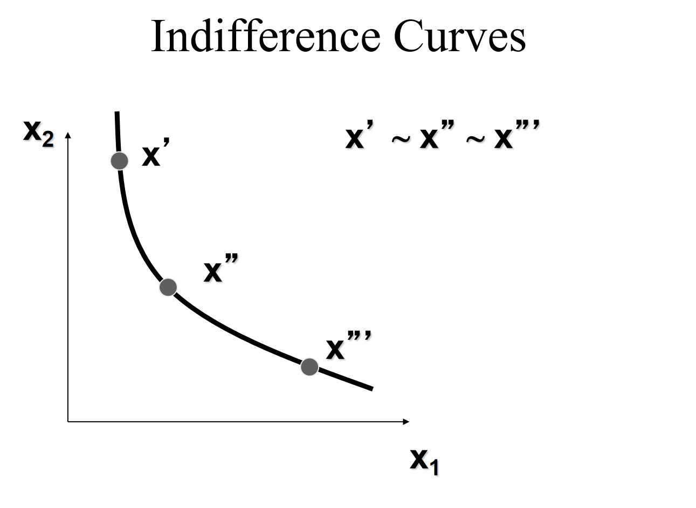
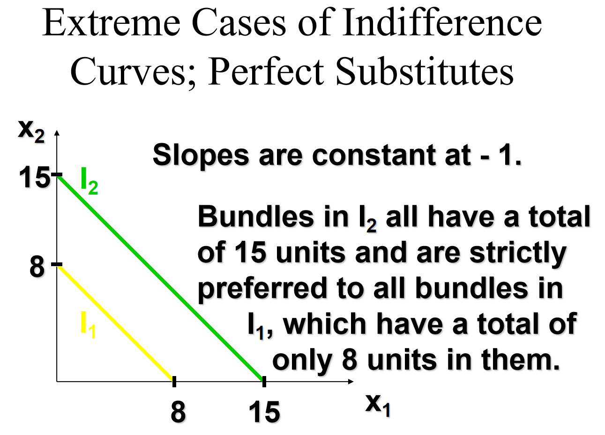
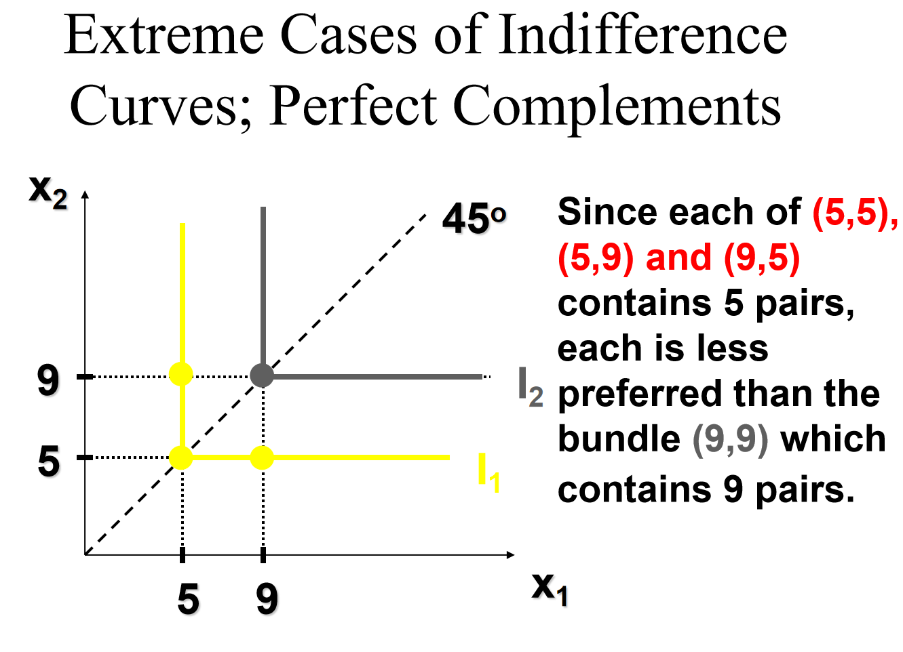
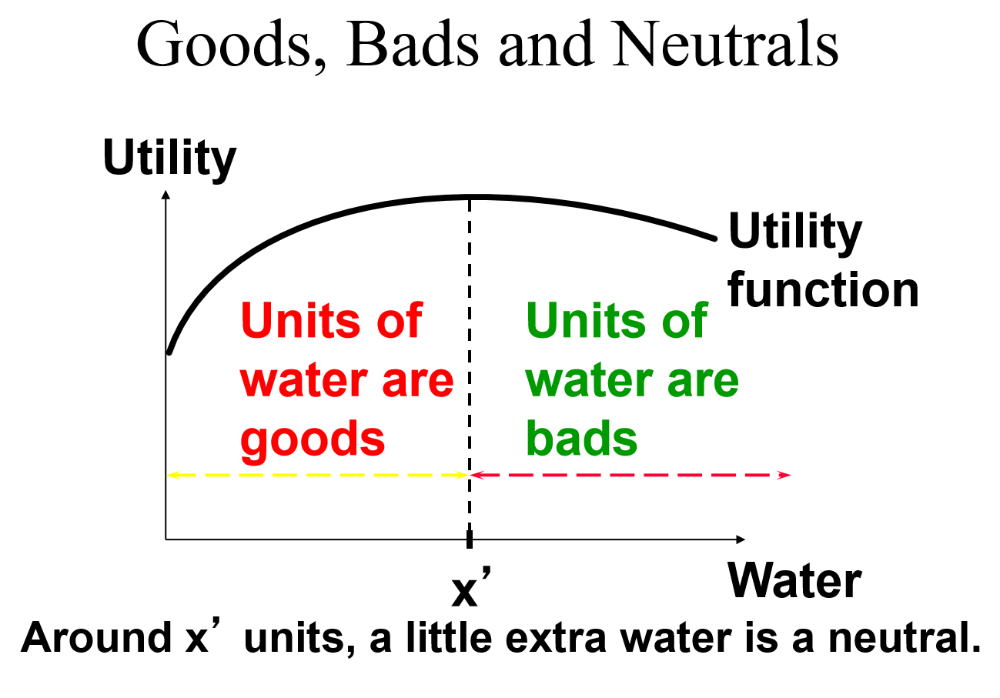
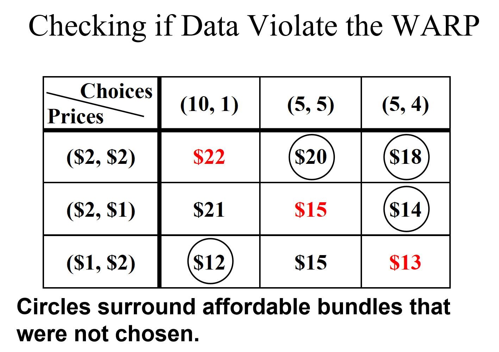

# Ch3 偏好

## 偏好关系

3种：

严格偏好于，strict preference

弱偏好于，weak preference

等价于，

## 关于偏好关系的基本假设

完备性（Completeness）：要么x弱偏好于y，要么y弱偏好于x

自反性（Reflexivity）：x至少和自身一样好

传递性（Transitivity）：

可能还有连续性和非饱和性

## 无差异曲线

横轴表示第一种商品的数量，纵轴表示第二种商品的数量

不同的无差异曲线不相交，除非重合

当两个商品都是好商品（经济品而非厌恶品）时，无差异曲线向下倾斜

### 特殊形状的无差异曲线

1.完全替代

2.完全互补

## 饱和点

偏好表现出饱和（Preferences Exhibiting Satiation）是指消费者在达到某个特定的商品组合后，不再希望增加任何商品的数量，因为增加商品的数量不再提高其效用，甚至可能降低效用。这种情况与通常假设的“非饱和性”相反。

### 关键特征：

1. **饱和点（Satiation Point）**：
   - 饱和点是指消费者达到最大效用的特定商品组合。在这个点上，消费者对任何商品的增加都不再感到满意。

2. **无差异曲线的形状**：
   - 在饱和点附近，无差异曲线可能是闭合的或呈现出环绕饱和点的形状。这意味着在饱和点周围的商品组合具有相同的效用水平。
   - 离开饱和点，无差异曲线可能会向外扩展，表示效用降低。

3. **经济直觉**：
   - 饱和偏好反映了消费者在达到某种商品组合后不再需要更多的商品。例如，一个人可能在拥有一定数量的食物和水后达到饱和点，增加更多的食物或水不会提高其效用。

### 实际例子：

- **食物和饮料**：在某个点上，增加食物或饮料的数量可能不再增加满足感，甚至可能导致不适。
- **生活空间**：一个人可能在拥有足够的生活空间后达到饱和，更多的空间不再增加其幸福感。

这种偏好模式在某些情况下是现实的，特别是在涉及到生理需求或有限资源的情境中。

## Well-Behaved Preferences

A preference relation is “well-behaved” if it is monotonic and convex.

Monotonicity: More of any commodity is always preferred (i.e. no satiation and every commodity is a good). 偏好更多的商品

Convexity（凸的）: Mixtures of bundles are (at least weakly) preferred to the bundles themselves. 即偏好多样性的商品组合

## 边际替代率

The slope of an indifference curve is its marginal rate-of-substitution (MRS). 

MRS = dx2/dx1 （商品1对商品2的）边际替代率，表示为了得到1单位商品1而愿意放弃的商品2的数量

边际替代率是负的

边际替代率递减规律：MRS always increases with x1 (becomes less negative) if and only if preferences are strictly convex. 在效用水平保持不变的条件下，随着一种商品消费数量的增加，消费者增加一单位该商品的消费而愿意房企的另外一种商品的消费数量逐渐减少。

# Ch4 效用

## 效用函数

A preference relation that is complete, reflexive, transitive and continuous can be represented by a continuous utility function.

Continuity（连续性） means that small changes to a consumption bundle cause only small changes to the preference level.

效用是一个序数的概念，也就是目前的理论都建立在序数效用上，而不是基数效用。因此一个偏好关系可以用不同效用函数来表示，只要它们表示的顺序一致就行。

例如：U(x1,x2) = x1x2

## 好商品、坏商品和中性品

A good is a commodity unit which increases utility (gives a more preferred bundle).

A bad is a commodity unit which decreases utility (gives a less preferred bundle).

A neutral is a commodity unit which does not change utility (gives an equally preferred bundle).

## 一些常见的效用函数

Any utility function of the form           U(x1,x2) = x1a x2bwith a > 0 and b > 0 is called a Cobb-Douglas utility function.

# Ch6 需求

## 自身价格变化

价格提供曲线

## 收入变化

收入提供曲线

# Ch7 显示性偏好

# Ch8 斯勒茨基方程

斯勒茨基：一个商品价格变化带来的该商品的需求变化可以被分解为替代效应和收入效应

正常品：替代效应和收入效应均为正，需求曲线向下。另一个商品的替代效应为负，收入效应为正，总效应为负

低档品分为普通低档品和吉芬商品

普通低档品：替代效应为正，收入效应为负，总效应为正。需求曲线向下

吉芬商品：替代效应为正，收入效应为负，总效应为负。需求曲线向上
