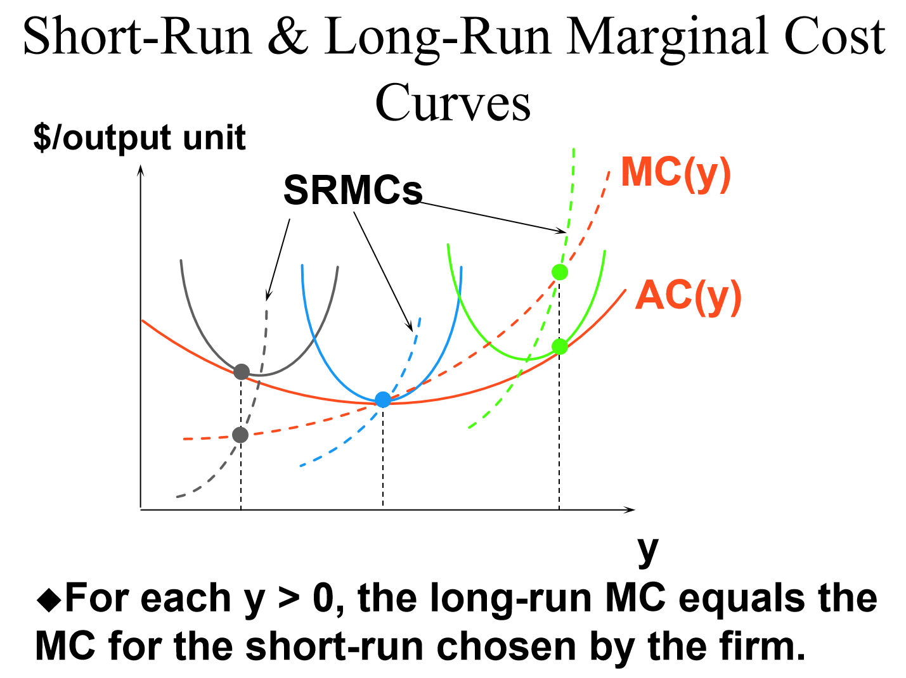

# Ch19

##

## 规模报酬

规模报酬递增（规模经济）、递减（规模不经济）、恒定

If, for any input bundle (x1,…,xn), f(kx1,kx2,…)< kf(x1,x2,...), then the technology exhibits diminishingreturns-to-scale.

# Ch22 成本曲线

长期中没有固定成本，因此只有三种成本曲线：总成本曲线、平均成本曲线和边际成本曲线

长期总成本曲线是无数条短期总成本曲线的包络线

同理，长期平均成本曲线是无数条短期平均成本曲线的包络线

但是长期边际成本曲线不是短期边际成本曲线的包络线。但是它依然和短期平均成本有关系，例如，在下图中灰点对应的产量上，长期平均成本曲线与短期平均成本曲线相切，这意味着长期总成本曲线也与短期总成本曲线相切（因为总成本=平均成本$\times$ 产量，而产量是一个定值），相切意味着斜率相同，而总成本曲线的斜率就是边际成本，因此在这个产量上，长期边际成本等于短期边际成本。并且对每个产量都是如此。

