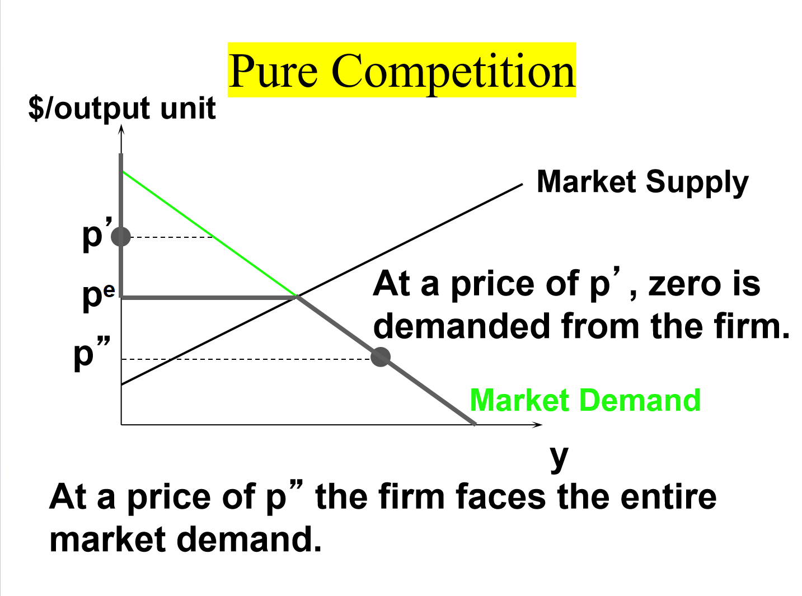

# Ch23 公司供给

利润最大化的一阶条件：利润对产量的一阶导等于0，即边际收益=边际成本

利润最大化的二阶条件：利润对产量的二阶导小于0，即边际成本随产量上升

所有企业的平均收益都等于市场价格（这意味着需求曲线总是和平均收益曲线重合），但是只有完全竞争企业的边际收益也等于市场价格，因为完全竞争企业总是在给定的市场价格上出售自己的产品。

短期内，平均可变成本AVC决定企业是否选择退出市场（停产），如果价格（即平均收益）大于AVC，则继续生产，如果小于，则停产。长期中，企业没有固定成本，因此只要价格小于AC，企业就会退出市场。

完全竞争企业的短期供给曲线与边际成本曲线重合（这里其实隐含了一个假定：边际成本曲线不受产品价格变化的影响，这在讨论单个企业时是可以认为成立的。但是在讨论整个行业或者市场时，这一假设是不成立的，因为整个行业生产的调整可能会影响到要素市场的价格，这在Ch24中会谈到）

经济效率的最大化 等价于 边际成本等于价格（P219）