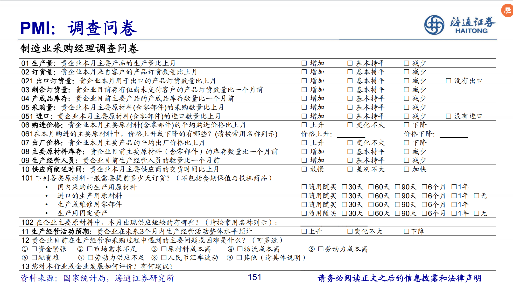
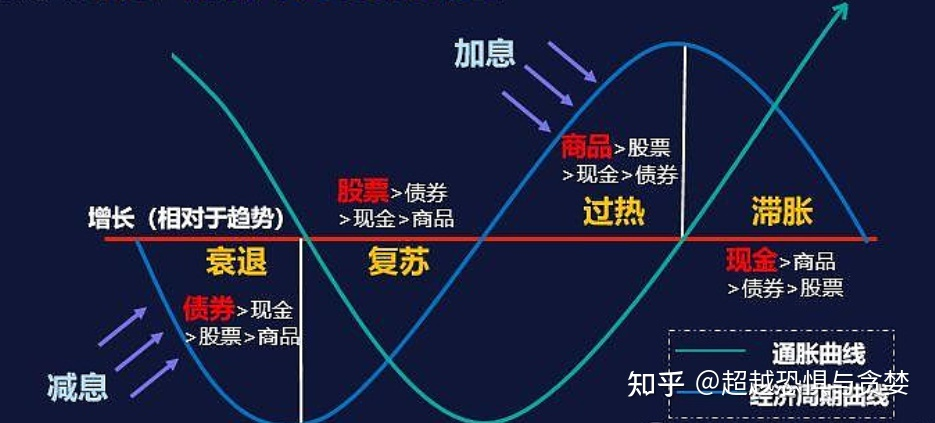
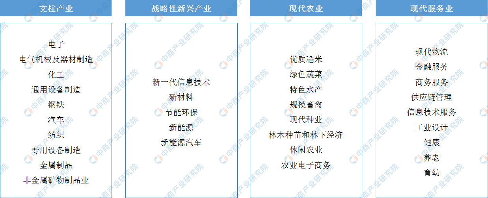
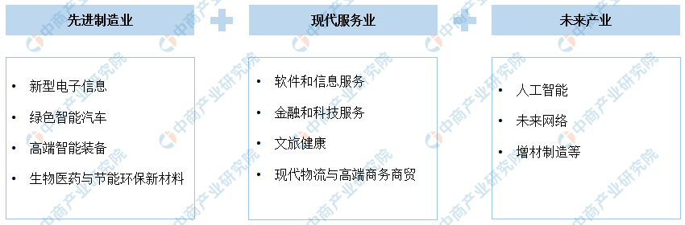
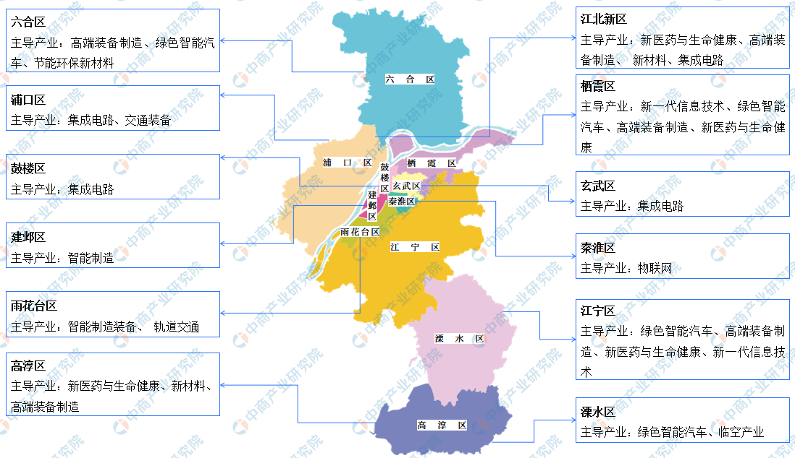
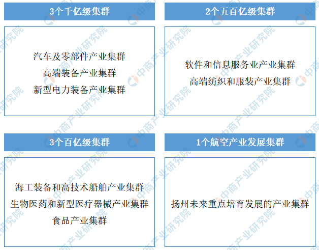
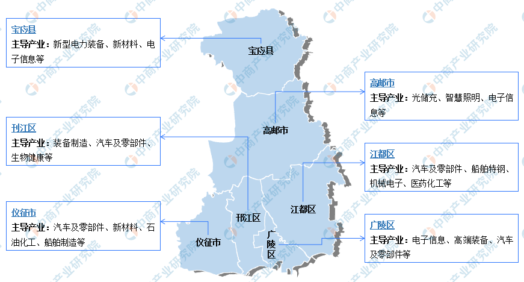
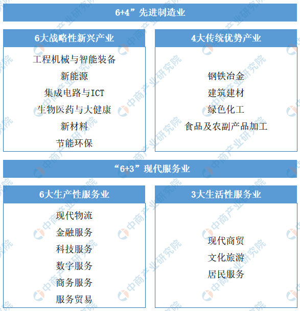
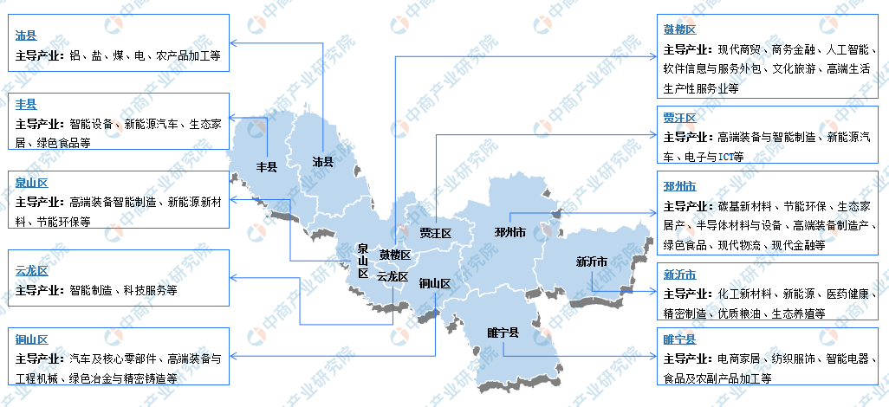

## 一、宏观经济

### （一）名词解释

1. 工业生产者出厂价格指数（Producer Price Index for Industrial Products， 简称PPI）

- **基本概念**：工业生产是社会再生产的重要组成部分，工业企业产品价格的涨跌，对企业的生产发展和国家宏观调控有着重要的影响。工业生产者出厂价格是工业企业产品第一次出售时的价格，通过编制工业生产者出厂价格指数（PPI），可以及时了解和掌握工业产品市场价格的变动情况。根据国际货币基金组织（IMF）《生产者价格指数手册》，生产者价格指数（Producer Price Index, 简称 PPI），理论上应涵盖所有产业的生产者价格指数，即包括农业生产者价格指数、工业生产者价格指数和服务业生产者价格指数。工业生产者价格指数是其中的重要组成部分，由于历史及技术原因，目前许多国家编制和发布的 PPI 仅指工业生产者出厂价格指数。工业生产者出厂价格指数，是反映工业生产企业产品出厂价格水平变动程度的相对数，PPI 报告期为月度。

- **意义**：PPI 反映了国民经济活动处于生产环节和上游领域的产品价格情况，对监测宏观经济运行情况、分析预测下游产品价格变化趋势具有重要作用。一般来说， 工业生产者出厂价格的上涨有利于工业行业企业效益的改善、行业利润的提升。一般认为，适度的通货膨胀是有利的。价格上涨，会刺激厂商多生产，而因为担心未来涨价，人们也愿意多消费，这样经济中需求供给都会增长，经济向好。而如果发生通货紧缩，商品价格下跌，厂商生产积极性不高，人们倾向于存钱不消费，因而不利于经济循环发展。

- **注意**：中国工业生产者价格指数**包括**工业生产者出厂价格指数（Producer Price Index for Industrial Products， 简称PPI）和工业生产者购进价格指数。工业生产者出厂价格指数是反映一定时期内全部工业产品第一次出售时的出厂价格总水平的变动趋势和变动幅度的相对数。工业生产者购进价格指数　是反映作为中间投入的原材料、燃料、动力购进价格总水平的变动趋势和变动幅度的相对数。

2. 居民消费价格指数（consumer price index，简称CPI）

  - 基本概念：CPI是度量消费商品及服务项目价格水平随着时间变动的相对数，反映居民购买的商品及服务项目价格水平的变动趋势和变动程度，报告期为月度。

  - 意义：（1）反映通货膨胀 ( 紧缩 ) 的程度。通货膨胀是指流通中的货币数量超过经济实际需要而引起的货币贬值和物价水平全面而持续的上涨。测定一定时期通货膨胀（紧缩）程度有不同的方法，但应用最普遍的就是通过物价指数（CPI 或 PPI），即以物价总水平上涨率（即物价指数减去基数 100% 的结果）作为通货膨胀率。严格地说，CPI 或 PPI 并不等于通货膨胀率，因为 CPI、PPI 都只反映了它们调查对象的价格变化，而不能代表全社会所有商品的价格变化，但从这两个指标的变化中，可以看出价格变动的大趋势。一般将 1%—3% 的年度 CPI 上涨率称为爬行的通货膨胀，将 3%—6% 的年度 CPI 上涨率称为温和的通货膨胀。超过10% 的物价上涨率应引起重视。我国从 1985 年开始统计全国的 CPI, 从 1985 年至2019 年的数据来看，CPI 最高涨幅出现在 1994 年，年度涨幅为 24.1%。下图是2000 年至 2019 年共二十年的 CPI 年度走势，除了 2002 年、2009 年 CPI 分别比上年下降 0.8% 和 0.7%，其他年份 CPI 涨幅从 0.4%—5.9% 不等。（2）用于国民经济核算。在 GDP 核算中，通常使用居民消费价格总指数及分类指数，对相关现价总量指标进行缩减，剔除价格变动因素的影响，实现不同时期经济指标之间的可比，从而计算不变价增长速度。（3）可用于计算货币购买力。CPI 的倒数通常被视为货币购买力指数，即货币购买力的变化与 CPI 的变化成反比关系。

  - 与PPI的联系：理论上，根据价格传导规律，企业生产加工所产生的成本通过产业链向下游扩散，最终将传导至消费者，因此通常认为PPI的变动对CPI具有一定的先导性。但是由于PPI主要偏向于生产资料价格，而CPI主要偏向于食品价格，同时还包括服务价格，两者在调查范围上并非严格的对应关系，因此CPI与PPI有时也会出现背离的情况。

    > **CPI上涨和PPI上涨，**意味着通货膨胀上升，经济增速加快，如果上涨幅度过大，会导致高通胀，进而使得经济衰退。
    > **CPI下跌和PPI下跌，**意味着经济发展放缓，如果下跌幅度过大，会导致通货紧缩，经济陷入衰退。
    > **CPI上涨和PPI下跌**，意味着企业利润增大，经济将进入一个扩张期。
    > **CPI下跌和PPI上涨**，意味着企业利润减少，经济有衰退的危险。

3. 采购经理指数 (Purchasing Managers’ Index，简称 PMI) 

- **基本概念**：PMI 是宏观经济变化的晴雨表，对国家经济活动的监测、预测和预警具有重要作用。PMI 指标体系包括制造业和非制造业领域，分别反映制造业和非制造业经济总体变化趋势，及企业经营活动多个侧面的运行情况。PMI 具有先行指数的特性，可以方便、及时地显示经济变化的趋势和范围，预测经济拐点。**PMI 取值范围在 0 至 100% 之间，50% 为扩张与收缩的临界点；高于 50%，表示经济活动比上月有所扩张；低于50%，表示经济活动比上月有所收缩。PMI 与临界点的距离， 表示扩张和收缩的程度**。在实际应用中，可以通过 PMI 运行走势监测宏观经济变化情况：

- **编制方法**：采购经理指数的编制方法，采用国际通行做法，即分类指数采用扩散指数法， 综合指数采用加权合成指数法。PMI 编制大致分为三个流程：计算分类指数、合成 PMI 综合指数、季节调整。

  ​    （一）分类指数计算。

  ​    制造业和非制造业 PMI 指数体系中的各分类指数均采用扩散指数方法计算， 即正向回答的企业个数百分比加上回答不变的百分比的一半。计算公式如下：

  ​    DI=“增加”选项的百分比 ×1+“持平”选项的百分比 ×0.5

  ​    （二）综合指数计算。

  ​    1.制造业 PMI 计算。

  ​    制造业 PMI 是一个综合指数，由新订单、生产、从业人员、供应商配送时间、原材料库存 5 个分类指数加权计算而成。其中供应商配送时间指数为逆指数，在合成制造业 PMI 综合指数时进行逆向运算。计算公式如下：

  ​    PMI= 新订单 ×30% + 生产 ×25% + 从业人员 ×20%+(100 －供应商配送时间 )×15% + 原材料库存 ×10%

  ​    2.综合 PMI 产出指数计算。

  ​    综合 PMI 产出指数由制造业生产指数和非制造业商务活动指数加权求和而成，权数分别为制造业和非制造业占两者增加值之和的比重。计算公式如下：

  ​    综合 PMI 产出指数 = 制造业生产指数 × 制造业权重+ 非制造业商务活动指数 × 非制造业权重

  ​    由于非制造业采购经理调查开展时间较短，目前尚没有国际通行的非制造业PMI 综合指数编制方法，世界上包括我国在内的大多数国家均使用商务活动指数反映非制造业经济发展的总体变化情况。

  ​    （三）季节调整。

  ​    采购经理调查是一项月度调查，受季节因素影响，数据波动较大。为了消除季节因素的影响，保证月度数据之间的可比性，国家统计局按照国际通行方法对所有指数进行了季节调整。

- **调查方法**：月度问卷调查，PPS（Probability Proportional to Size）方法抽样

  ✓ **以制造业或非制造业行业大类为层**

  ✓ **行业样本**：按增加值占全部制造业或非制造业增加值的比重分配问卷

  ✓ **层内样本**：按与企业主营业务收入成比例的概率抽取（PPS）

  ✓ 注：所以PMI走势更多与大中型企业的情况一致

  

   

4. 中期借贷便利（Medium-term Lending Facility，简称MLF或”麻辣粉“）

- 基本概念：MLF是中央银行提供中期基础货币的货币政策工具。于2014年9月由中国人民银行创设。对象为符合宏观审慎管理要求的商业银行、政策性银行，可通过招标方式开展。发放方式为质押方式，并需提供国债、央行票据、政策性金融债、高等级信用债等优质债券作为合格质押品。**简单点说就是人民银行通过招标方式，选择合适的商业银行，按中标利率借钱给商业银行，同时商业银行将优质的债券作为质押品的过程。“人民银行开展中期借贷便利（MLF）操作3000亿元，利息是3.25%”的意思是：各家银行可以问央行总计借出3000亿元，他们给央行的利息是3.25%。**MLF的期限不固定，既然名字是中期借贷便利，则期限通常在三个月以上。常见的是一年期MLF。

- 意义：**经过改革之后，现在贷款市场报价利率（LPR）主要是由中期借贷便利利率（MLF），加点形成。**

5. 贷款市场报价利率（Loan Prime Rate，简称LPR）

- **基本概念**：贷款市场报价利率（LPR）由各报价行按公开市场操作利率（主要指中期借贷便利利率）加点形成的方式报价，由全国银行间同业拆借中心计算得出，为银行贷款提供定价参考。目前，LPR包括1年期和5年期以上两个品种。LPR报价行目前包括18家银行，每月20日（遇节假日顺延）9时前，各报价行以0.05个百分点为步长，向全国银行间同业拆借中心提交报价，全国银行间同业拆借中心按去掉最高和最低报价后算术平均，并向0.05%的整数倍就近取整计算得出LPR，于当日9时15分公布，公众可在全国银行间同业拆借中心和中国人民银行网站查询。

- **意义：贷款合同中的实际贷款利率=LPR+加点。例如房贷利率=LPR+政策加点+银行加点。其中，加点的值可正可负，**但是签订合同后，在贷款存续期内加点值保持不变。如果LPR值出现变动，将在下一个重定价周期中，以新的LPR和固定的加点值之和来计算贷款利息。重定价周期，是指在实际贷款利率中用最新的LPR值来计算的周期，重定价周期的起止日被称为重定价日。一般按揭贷款的重定价周期为一年，元旦即为重定价日，所以每年的元旦都是以最新的LPR值进行计算。一年时间内，不论LPR变动几次，实际贷款利率也不会立刻发生改变，而是到下一个重定价日再进行变动。

- **1年期和5年期LPR的区别**：（1）适用的贷款期限不同：一年至五年贷款期限的贷款，以一年期的LPR作为参考；贷款期限五年以上的贷款，就以五年期LPR作为参考。例如大部分用户申请房贷，参考的都是五年期LPR，因为用户的贷款年限普遍在5年以上。（2）报价机制不同：1年期lpr利率报价是建立在资金成本、风险成本、资金占用成本以及操作成本的基础上得出的；而5年期lpr的报价为1年期lpr+期限溢价。

查看LPR历史数据：https://www.chinamoney.com.cn/chinese/bklpr/

6. 回购和逆回购

回购市场是指通过回购协议进行短期资金融通的市场。所谓回购协议是指证券持有人在出售证券的同时，与证券购买商约定在一定期限后再按约定价格购回所售证券的协议。例如，某交易商为筹集隔夜资金，将100万元的国库券以回购协议卖给甲银行，售出价为999800元，约定第二天再购回，购回价为100万元。在这里，交易商与甲银行进行的就是一笔回购交易。注意，在回购交易中先出售证券、后购回证券称为正回购；先购入证券、后出售证券则为逆回购。如该例中交易商所做的即为正回购，而甲银行所做的则为逆回购。回购交易实际上是一种以有价证券（大多为国债）为抵押品的短期融资活动。在回购交易中，证券持有者通过出售证券融入资金，而证券购买者通过买人证券融出资金。

**央行逆回购**，是指央行向一级交易商购买有价证券，借出资金，并约定在未来特定日期再将有价证券卖给一级交易商的交易行为。简单解释就是主动借出资金，获取债券质押的交易就称为逆回购交易，此时投资者就是接受债券质押，借出资金的融出方。反之，央行正回购，就是央行向一级交易商卖出债券，回笼资金，到期后再买回去的操作。

其中，一级交易商主要是资金实力比较雄厚的大型商业银行和证券公司，央行通过逆回购将资金释放给一级交易商，再由一级交易商将资金拆借给市场上的中小金融机构，中小金融机构再通过信贷、投资等方式将资金释放到实体经济中。

逆回购有何意义呢？

一是释放流动性，逆回购操作量净增加，说明央行认为市场资金紧张，通过购买一级交易商持有的债券，向市场释放流动性。

二是传达货币政策意图，由于逆回购操作简便迅速，能够迅速反应央行对市场资金的判断，因此已经成为市场新的利率风向标。

三是精准控制基础货币投放，众所周知存款准备金率是基础货币投放的大招，但是牵一发而动全身，正逆回购起到了微调存款准备金率的作用。

7. “四上”企业

“四上”企业是现阶段我国统计工作实践中对达到一定规模、资质或限额的法人单位的一种习惯称谓。包括规模以上工业、有资质的建筑业、限额以上批发和零售业、限额以上住宿和餐饮业、有开发经营活动的全部房地产开发经营业、规模以上服务业法人单位。确定以上法人单位的标准为：

　　1.规模以上工业：年主营业务收入2000万元及以上的工业法人单位。

　　2.有资质的建筑业：有总承包、专业承包资质的建筑业法人单位。

　　3.限额以上批发和零售业：年主营业务收入2000万元及以上的批发业、年主营业务收入500万元及以上的零售业法人单位。

　　4.限额以上住宿和餐饮业：年主营业务收入200万元及以上的住宿和餐饮业法人单位。

　　5.房地产开发经营业：有开发经营活动的全部房地产开发经营业法人单位。

　　6.规模以上服务业：年营业收入2000万元及以上服务业法人单位，包括：交通运输、仓储和邮政业，信息传输、软件和信息技术服务业，水利、环境和公共设施管理业三个门类和卫生行业大类；年营业收入1000万元及以上服务业法人单位，包括租赁和商务服务业，科学研究和技术服务业，教育三个门类，以及物业管理、房地产中介服务、房地产租赁经营和其他房地产业四个行业小类；年营业收入500万元及以上服务业法人单位，包括：居民服务、修理和其他服务业，文化、体育和娱乐业两个门类，以及社会工作行业大类。

### （二）周期

| 经济周期         | 周期长度 | 内容                                                         |
| ---------------- | -------- | ------------------------------------------------------------ |
| 基钦周期         | 3~4年    | 受厂商库存投资驱动，又称“库存周期”                           |
| 朱格拉周期       | 9~10年   | 受设备更替和资本投资驱动，生产设备的周期性更替带动了固定资产投资的周期性变动，进而导致经济周期性变化 |
| 库兹涅茨周期     | 15~25年  | 受房产业和建筑业驱动，房地产向好时带动上下游发展，推动经济繁荣，房地产业衰退时，上下游需求回落，经济衰退 |
| 康德拉季耶夫周期 | 50~60年  | 受技术创新驱动，以创新型技术变革为起点，技术不断颠覆更新推动经济增长，后随技术成熟，经济增长动力缺乏，增速回落。现阶段全球经济正处于以信息技术为标志性技术创新的第五轮康波周期中 |

1. 库存周期

　　库存周期也被称为基钦周期，基钦周期是现代西方经济学关于资本主义经济周期性波动的一种理论。它是由美国经济学家约瑟夫·基钦于1923年提出的。基钦根据对物价、生产和就业的统计资料的分析，认为资本主义经济的发展，每隔40个月就会出现一次有规律的上下波动。同样，在行业经济的研究上，通过观察库存状况及其变动原因的周期性变化，分析行业的市场环境和景气度，一个库存由降到增再降的余弦曲线周期被称为库存周期。

　　对于强周期性行业而言，由于其产能具有连续生产的特点，且产能增加耗时较长，而需求具有季节性、间歇性、滞后性、惯性等波动性的特点，因此库存形成的连续性和稳定性与需求波动性的矛盾，就决定了其生产者库存会呈现高低波动循环的特征，一个完整的循环就称为一个库存周期。库存周期大概可以分为四大阶段：

　　**被动去库存阶段(复苏）**。由于社会发展，价格持续下降，需求逐步放大，需求首先突破均衡点，出现库存低于行业正常库存的情况，此情况的出现表明产品已经供不应求。潜在消费者由于担心涨价和供应不足，会纷纷加入到增加采购的行列，需求增加，价格上升，库存一直减少。主动去库存阶段的特点是库存低于正常库存，需求增加，价格上升，形成普遍的涨价预期。

　　**主动增库存阶段（繁荣）**。由于产品价格进一步上扬，导致产能供给逐步增加，同时高价格又抑制消费需求的进一步放大，理性消费者开始消费前期储备的产品而减少新的采购，供不应求的情况开始改变，价格逐步见顶，库存从最低点开始上升。

　　**被动增库存阶段（衰退）**。由于供给的刚性，新增加的产能和原有产能在持续地形成库存，而消费需求由于预期供应增加、价格回落以及其它波动性的原因而继续减缓，供给超过了需求，库存不断上升。在被动增库存阶段的特点是：库存超过行业正常周转库存量并继续上升，价格继续下跌，末期，部分产能开始主动减产；同时，消费者自身库存在减少，需求潜力在逐步形成。

　　**主动去库存阶段（萧条）**。生产者库存增加到自身难以承受，盈利状况开始恶化，就会减少生产、大幅度降价促销、甚至部分产能退出市场，整体供应主动减少。此时，供应增加的速度下降，供应速度小于消费者消耗的速度，库存达到最高点并开始缓慢下降。从需求的角度看，需求总体是增长的，但是弱于供给增速，企业通过主动降价促销去库存。主动去库存阶段的特点是：供应开始下降、需求依旧偏弱，生产者主动降价，库存从最高位持续下降（转移到消费者库存），但仍然高于行业正常水平。

### （三）货币政策

货币的本质是债务

## 二、金融市场

1. ST、*ST和PT

ST股票：根据证监会规定，当一个公司连续两年亏损或者净资产低于股票面值的时候，在股票名称前就会加上“ST”，表示“特殊处理”的意思。ST股票每天的涨跌都不得超过5%。用于警示投资者注意投资风险和防止庄家恶意炒作。

如果在第三年，公司的经营未有改善，依旧处于亏损状态，股票名称前除“ST”外还会加上“\*”，即**“\*ST”**，意为有退市风险。ST股票的风险要比一般的股票大的多，建议普通投资者谨慎投资。如果真的要选择ST股票，也要自习筛选，考虑风险因素。

PT股票：即特别转让。依据《公司法》和《证券法》规定，上市公司出现连续三年亏损等情况，其股票将暂停上市。沪深交易所对这类暂停上市的股票实施特别转让服务，并在其简称前冠以PT，称之为PT股票。

2. 行业分类

分类采用经济活动的同质性原则划分，每一个行业类别按照同一种经济活动的性质划分。分类共分为门类、大类、中类和小类四个层次，共包含门类 20 个，大类 97 个，中类 473 个和小类 1382 个。每个类别都按层次编制了代码。门类用一个英文大写字母表示（如 A、B、C、…）；大类用 2 位阿拉伯数字表示，中类用 3 位阿拉伯数字表示，前 2 位为大类代码，第 3 位为中类的本体码；小类用 4 位阿拉伯数字表示，前 3 位为中类代码，第 4 位为小类的本体码。

3. 担保法规定的五种担保方式

根据1995年颁布的《中华人民共和国担保法》，担保的方式有五种，分别是保证、抵押、质押、留置和定金。

- 保证，是指保证人和债权人约定，当债务人不履行债务时，保证人按照约定履行债务或者承担责任的行为。保证的方式有两种：（1）一般保证，当事人在保证合同中约定，债务人不能履行债务时，由保证人承担保证责任的，为一般保证。一般保证的保证人在主合同纠纷未经审判或者仲裁，并就债务人财产依法强制执行仍不能履行债务前，对债权人可以拒绝承担保证责任。（2）连带责任保证，当事人在保证合同中约定保证人与债务人对债务承担连带责任的，为连带责任保证。连带责任保证的债务人在主合同规定的债务履行期届满没有履行债务的，债权人可以要求债务人履行债务，也可以要求保证人在其保证范围内承担保证责任。
- 抵押，是指债务人或者第三人不转移对财产的占有，将该财产作为债权的担保。债务人不履行债务时，债权人有权依照本法规定以该财产折价或者以拍卖、变卖该财产的价款优先受偿。
- 质押，是指债务人或者第三人将其动产移交债权人占有，将该动产作为债权的担保。债务人不履行债务时，债权人有权以该动产折价或者以拍卖、变卖该动产的价款优先受偿。
- 留置，是指债权人按照合同约定占有债务人的动产，债务人不按照合同约定的期限履行债务的，债权人有权留置该财产，以该财产折价或者以拍卖、变卖该财产的价款优先受偿。
- 定金，当事人可以约定一方向对方给付定金作为债权的担保。债务人履行债务后，定金应当抵作价款或者收回。给付定金的一方不履行约定的债务的，无权要求返还定金；收受定金的一方不履行约定的债务的，应当双倍返还定金。
- **注意**：抵押标的为动产与不动产，通常为不动产；质押标的为动产与权利。《民法典》第115条规定，物包括不动产和动产。动产与不动产的划分，是以物是否能够移动并且是否因移动而损坏其价值作为划分标准的。动产是指能够移动而不损害其价值或用途的物，不动产则是指不能移动或者若移动则损害其价值或用途的物。常见的不动产包括土地（耕地、建筑用地、林地、草原、水面、荒山、荒地、滩涂等）、建筑物及构筑物、林木、与不动产尚未分离的出产物（如农作物）。除不动产以外的财产均是动产，如机器设备、车辆、动物、生活日用品等。
4. 基本面、技术面和信息面

**技术面**

市场在交易的过程中会出现各种各样的数据，崇尚技术面的投资者认为，通过研究以往的价格和交易量等的数据，可以预测未来的价格走势，技术面的分析侧重于图标和数学公式，捕获主要和次要的趋势，通过估测市场周期的长短，识别买入或者卖出的机会，我们常见的利用移动平均线、MACD指标、KDJ指标等等来判断市场都是利用的技术面的分析方法。

**基本面**

通过对宏观经济、行业背景、公司经营能力、财务状况等等诸多方面的考察，以判断市场未来的走势的方法就是基本面的分析方法，基本面的分析方法是以内在价值为依据，着重于对影响证券价格以及走势的各项因素的分析来判断市场的买点和卖点。基本面的分析主要适用于周期相对比较长的市场、相对成熟的市场和对精确度要求不高的市场的预测。从本质上来说，基本面为市场行情提供了基本的方向指引。举个例子，某一个产品达到的需求的旺季，大家就会预期这种产品价格会上涨。

**消息面**

消息面是引发短线波动的重要因素，要么是对已有的行情趋势推波助澜要么可能终结逆转当前的行情趋势。如果消息与原有的行情基本面保持一致，一般市场会沿着原来的方向继续运行，如果消息与原有的行情是相反的，往往带来的影响都是颠覆性的结果。

举个例子：如果钢材需求达到旺季，铁矿石价格收疫情影响上涨，那么未来一段时间钢材价格会因为需求继续走高，如果铁矿石进口剧增，造成库存明显增多，那么，这个消息对钢材未来价格上涨未必是好消息。

## 三、产业经济（中观）

（一）江苏

产业体系布局

“十四五”时期，江苏省聚力打造制造强省，积极构建自主可控安全高效的现代产业体系，大力发展电子等10大支柱产业，培育新一代信息技术等5大战略性新兴产业，打造优质稻米、绿色[蔬菜](http://www.askci.com/reports/2016/03/02/024207420468.shtml)等8个千亿元级优势特色产业，加快发展生活性服务业和生产性服务业。

江苏现代产业体系

1. 南京

**产业布局体系：“4+4+1”主导产业**

南京正在构建“先进制造业+现代服务业+未来产业”的主导产业发展体系，并将新能源汽车、集成电路、人工智能、软件和信息服务、生物医药等作为地标产业来重点打造。南京将现有7大类14个战略性新兴产业优化为“4+4+1”主导产业体系，整合全市科技园区，设立15个高新园区，争创国家综合性科技中心城市。

**第一个“4”**是打造四大先进制造业：新型电子信息、绿色智能汽车、高端智能装备、生物医药与节能环保新材料。

**第二个“4”**是打造软件和信息服务、金融和科技服务、文旅健康、现代物流与高端商务商贸。

**“1”**是指围绕具有重大产业变革前景的颠覆性技术及其新产品、新业态，布局人工智能、未来网络、增材制造，以及前沿新材料、生命健康等交叉应用领域。

“4+4+1”主导产业

各区域主导产业

2. 扬州

**产业体系布局：**

“十四五”时期，扬州市现代产业体系加快构建，“3+2+3+1”先进制造业集群竞争力大幅提升，构建具有扬州特色、在全国有影响力的产业集群。重点巩固提升[汽车](http://www.askci.com/reports/20180123/0852344087824516.shtml)及零部件、高端装备、新型[电力](http://www.askci.com/reports/20180310/1127293563830322.shtml)装备等优势支柱产业，培育做大软件和信息服务、生物[医药](http://www.askci.com/reports/20180226/1442074424829153.shtml)和新型医疗器械、航空等新兴产业，转型提升高端纺织和服装、食品等传统特色产业。

各区域主导产业

3. 徐州

**产业体系布局：**

“十四五”时期，徐州市以构建“6+4”先进制造业和“6+3”现代服务业产业体系为重点，推进产业基础高级化、产业链现代化，加快“两业”深度融合，夯实实体经济根基，积极壮大县域经济，高水平建设国家产业转型升级示范区，打造具有全球影响力的先进制造业基地和区域性现代服务业高地。

制造业是徐州市最重要的经济支柱之一，占据了地区生产总值的很大一部分。拥有享誉全球的徐工集团，徐工集团营业收入连续三年超千亿元，旗下13个主机市场占有率稳居国内第一，工程机械综合实力居世界前三，中国第一。作为中国工程机械之都，徐州以徐工为龙头，是全国工程机械产品类别、产品品种最齐全的地区之一。

各区域主导产业

## 四、微观经济

1. 寻租：政府官员出租权力，换取商人的经济回报，这种经济回报可以理解为商人为获得权力而支付的“租金”，简言之就是政府官员以权谋私。

## 五、参考文献

1. 经济学五大顶刊：the American Economic Review (AER), Econometrica (ECA), the Journal of Political Economy (JPE), the Quarterly Journal of Economics (QJE), and the Review of Economic Studies (RES)

