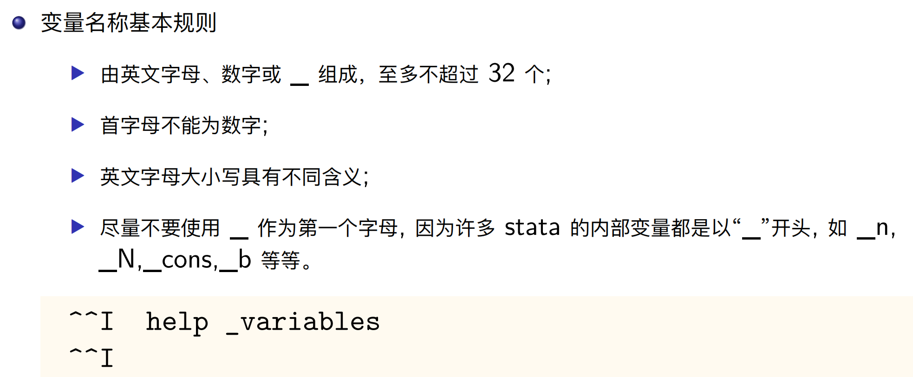

# Lab1 Introduction

## 1.1 什么是Stata


## 1.4 Stata的基本设置

1. ```stata
   sysdir //查看系统目录
   cd //更改工作路径
   pwd //查看当前工作路径
   cdout //打开当前工作路径对应的文件夹，没啥用
   ```

2. 使用与路径相关的命令（比如`cd`,`whereis`等）指定路径的时侯，后面的路径必须用双引号包起来 

3. 使用`sys`可查看外部命令默认安装的位置为`C:\Users\LENOVO\ado\plus\`，如果想把外部命令安装在指定路径（如D:\Stata 17 MP\ado\plus\），可以通过`sysdir set PLUS "D:\Stata 17 MP\ado\plus\"`来实现。但是如果关闭stata之后重新打开，则安装路径又会自动变回默认路径，需要重新手动设置。

4. 数据文件集.dta
   日志文件log文件：.txt .smcl
   命令集do文件：.do

5. `ado`查看已经安装的外部命令

6. 设置全局路径

```stata
global root "C:\Users\LENOVO\Documents\stata\homework\hw1"
global dof     $root/Dofiles  // 所有dofiles 
global tabl    $root/Tables   // 所有表格
global figs    $root/Figures  // 所有图片
global logf    $root/Logfile  // 所有log文件，如果profile文件设定过自动记录，这个可以不使用。
global raw     $root/RawData  // 原始数据，只读不能修改。
global saved   $root/SaveData // 清理好之后的重要数据，保存待使用。
global work    $root/WorkData // 
** 生成相应的文件夹

cap mkdir ${dof}
cap mkdir ${tabl}
cap mkdir ${figs}
cap mkdir ${logf}
cap mkdir ${raw}
cap mkdir ${saved}
cap mkdir ${work}

** 设定工作目录为当前目录

pwd 
cd ${work}

use $raw\2002-1.dta
```


## 1.6 导入和导出数据

1. 导入

   ```stata
   global root "D:\Teaching\Stata\lab1\" //定义全局宏
   cd "$root"
   use auto1.dta,clear
   shellout auto1.txt //shellout opens a document from inside Stata without having to specify the exact file path of the program. 
   edit //打开数据编辑器
   ```

2. 查看数据

   ```stata
   describe [varlist] [, memory_options] 
   describe [varlist] using filename [, file_options] //des,给出数据集的基本信息，比如数据集名称、数据的存储方式等
   list [varlist]
   list price gear in 1/5
   browse //查看原始数据
   
   summarize [varlist] //sum,给出数据集的一些数字特征，比如均值、标准差等
   codebook [varlist] //在summarize基础上多给出分位数等
   
   tabulate [varlist] //tab,查看数据出现频数和频率，比如foreign和domestic，可以用来分组
                      //如：tabulate foreign rep78, summarize(mpg)
   table //不如tabulate
   tabstat //常用，相当于可编辑的summarize
   tabstat price weight length, stats(mean med min max) col(s) format(%6.2f) //stats用于指定你想要展示的统计量，col(s)表示把统计量作为列（默认是行）
   tabstat price weight length, s(mean p25 med p75 min max) c(s) f(%6.2f)
   tabstat price weight length, s(mean sd p25 med p75 min max) c(s) f(%6.2f) by(foreign)
   
   *列出所有（符合条件的）变量
    ds -- Compactly list variables with specified properties
   ```

3. 更改和删除数据 

```stata
sysuse nlsw88.dta, clear
keep wage race ttl_exp //只保留这三个变量数据
keep in 1/5

drop if race==2
drop wage-ttl_exp
drop _all //删除内存中的所有变量
drop wage //由于已经不存在任何变量，所以报错
capture drop wage //加capture，不会报错

replace hours = 40 if (hours > 40) //假如法定工作周时间不超过40小时
sysuse auto, clear
list make in 50/59
replace make="宝马 320i" if (make=="BMW 320i") //文字变量观察值的修改要加【""】
list make in 50/59

clear

```

4. 生成新数据

```stata
generate [type] newvar[:lblname] =exp //gen
gen workhour = P147A*P147B*12
```

5. 保存数据

```stata
sysuse auto, clear
keep in 1/10
save auto3.dta,replace
```


6. 变量命名和重命名

```stata
rename oldname newname //变量中不能出现空格，只能出现一个破折号
```


7. 变量类型和展示方式

```stata
recast type varlist [, force]
format price %6.1f
```


8. 标签

```stata
label data "这是一份汽车价格资料"

label var price "汽车价格"
label var foreign "汽车产地(1 国外; 2 国内)"

label define repair 1 "好" 2 "较好" 3 "中" 4 "较差" 5 "差  //repair相当于是一个字典
label values rep78 repair //把repairh和变量rep78的值进行配对

label list [varlist] //列出值标签的名称和内容，注意输入的一定是值标签的名称（value label,比如上面的repair），不是变量的名称
label drop repair //删除repair
label list
labelbook // 推荐使用
```


## 1.8 Do File

1. `doedit`新建一个do文件，`doedit filename`打开一个已有的do文件
2. 代码断行是`///`


## 1.9 Log File

日志文件用来对已进行的操作进行“录屏”

```stata
log using "$root\lab1_0916.log" //新建Log文件
log off // 暂停录制
log on // 继续录制
log close //结束录制
shellout "$root\lab1_0916.log"
```